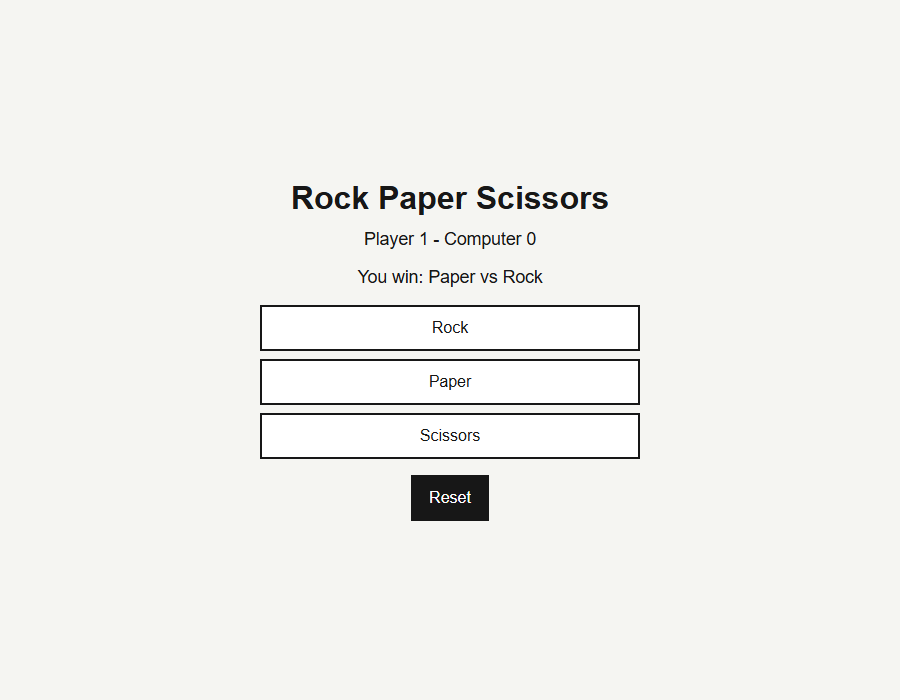

# 데일리 클래식 게임

날짜별로 작은 클래식 브라우저 게임을 모아두는 저장소입니다. 각 게임은 새 의존성 없이 정적 HTML, CSS, JavaScript만 사용합니다.

## 게임 목록

| 날짜 | 게임 | 설명 | 열기 |
| --- | --- | --- | --- |
| 2026-04-24 | 틱택토 | 두 플레이어가 번갈아 3x3 칸에 표시를 놓는 게임입니다. | [열기](daily/2026-04-24-tic-tac-toe/index.html) |
| 2026-04-27 | 메모리 매치 | 카드를 뒤집어 같은 짝을 모두 찾는 게임입니다. | [열기](daily/2026-04-27-memory-match/index.html) |
| 2026-04-27 | 가위바위보 | 하나의 수를 골라 컴퓨터와 라운드 점수를 겨루는 게임입니다. | [열기](daily/2026-04-27-rock-paper-scissors/index.html) |

## 게임 화면

가위바위보를 실제로 한 판 진행한 화면입니다.



## 테스트

로직 테스트는 Node.js 내장 모듈만 사용합니다.

```bash
node daily/2026-04-24-tic-tac-toe/game-logic.test.js
node daily/2026-04-27-memory-match/game-logic.test.js
node daily/2026-04-27-rock-paper-scissors/game-logic.test.js
```
