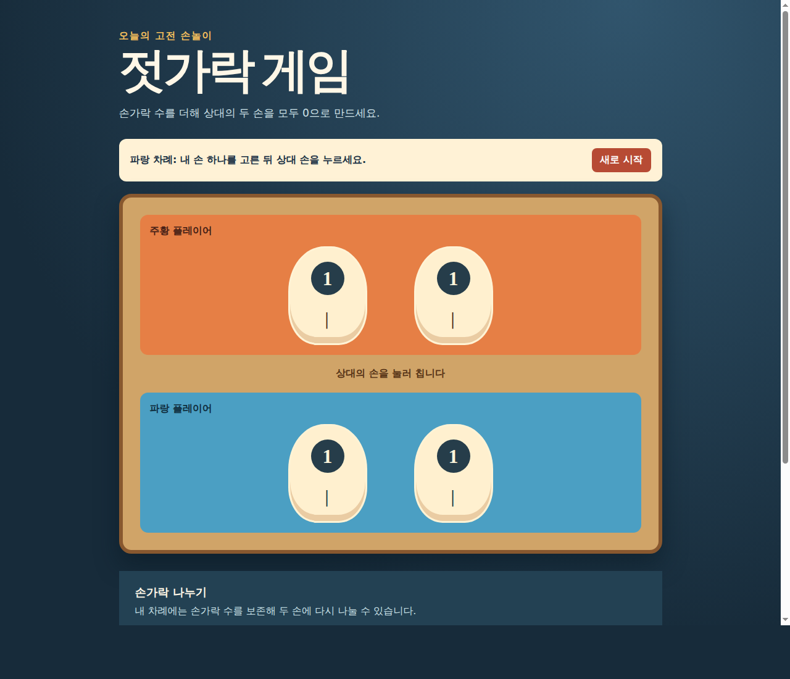
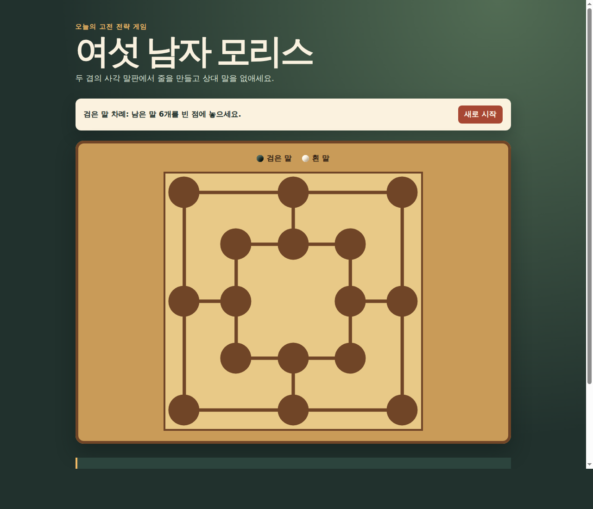
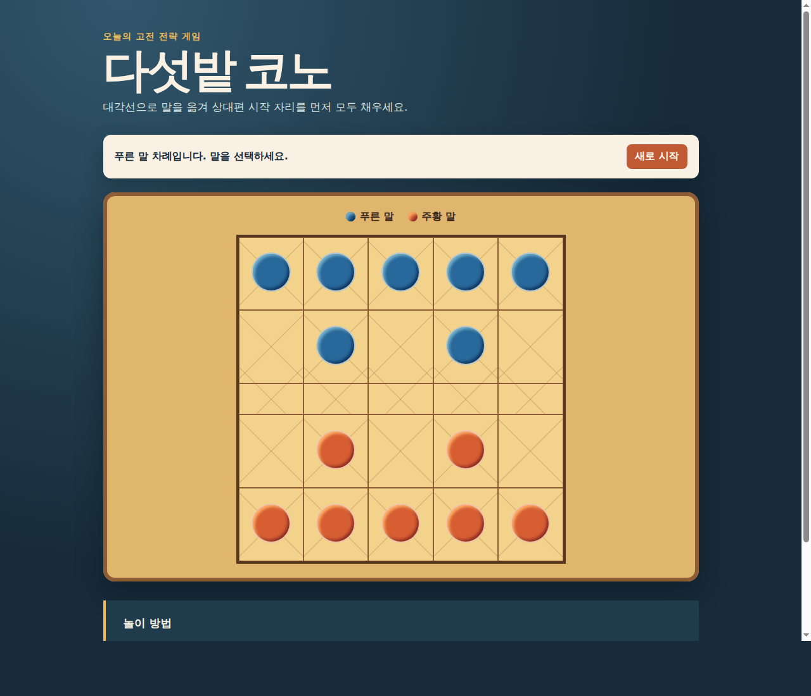
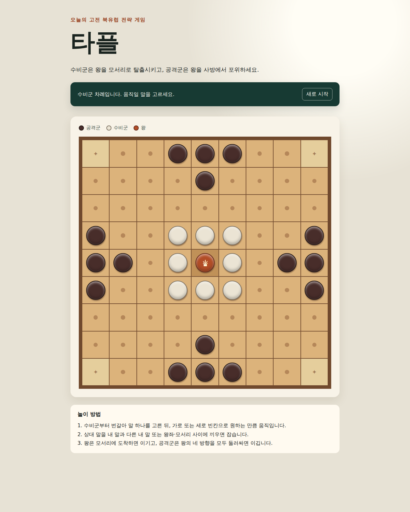
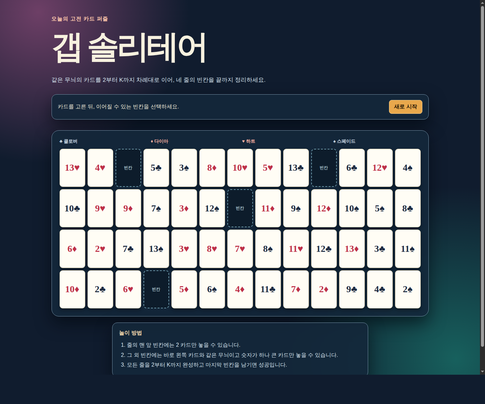
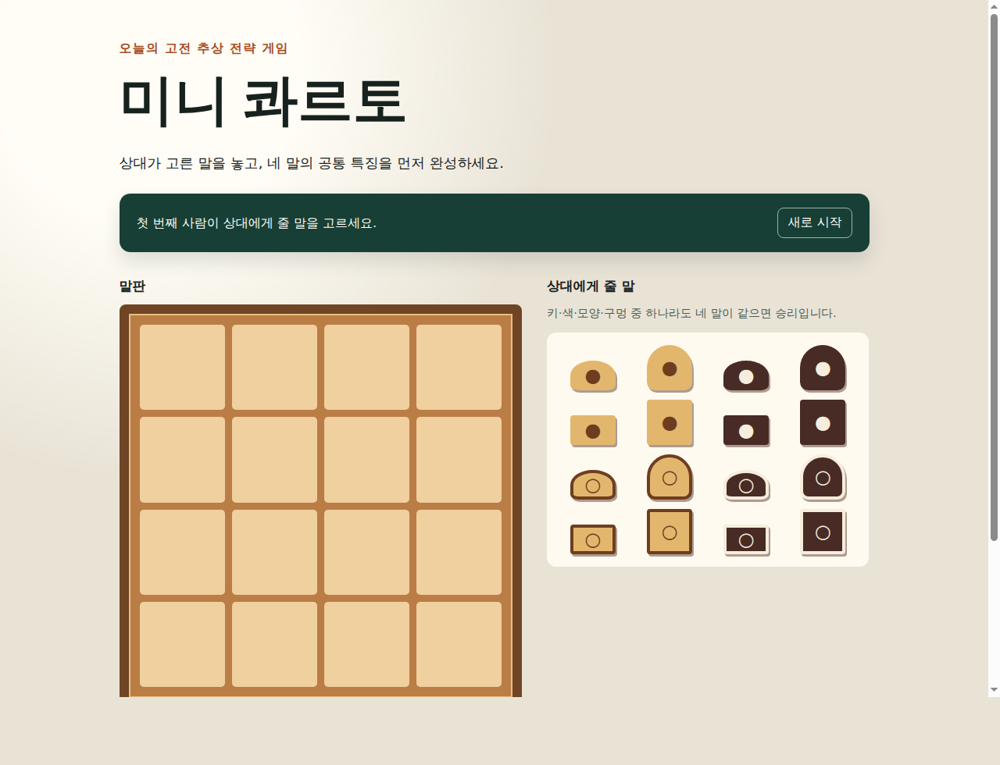
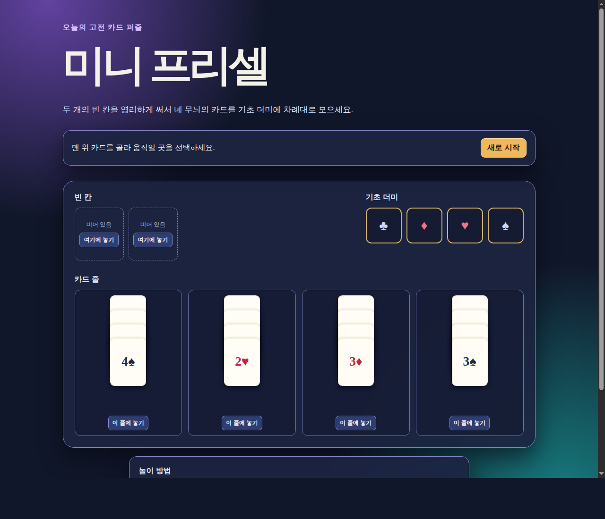

# 데일리 클래식 게임

날짜별로 작은 클래식 브라우저 게임을 모아두는 저장소입니다. 각 게임은 새 의존성 없이 정적 HTML, CSS, JavaScript만 사용합니다.

이전 게임 설명과 화면은 [아카이브](archive/README-games.md)에 보관합니다.

## 최근 게임 목록

| 날짜 | 게임 | 설명 |
| --- | --- | --- |
| 2026-08-30 | 젓가락 게임 | 내 손가락 수를 상대 손에 더해 5가 되면 0으로 만들고, 손가락을 다시 나누며 상대의 두 손을 먼저 모두 0으로 만드는 고전 손놀이입니다. |
| 2026-08-29 | 여섯 남자 모리스 | 두 겹의 사각 말판에 여섯 개의 말을 놓고 가로·세로 한 줄을 만들어 상대 말을 없애거나 움직이지 못하게 하는 고전 전략 게임입니다. |
| 2026-08-28 | 다섯밭 코노 | 대각선으로 말 일곱 개를 한 칸씩 옮겨 상대편의 처음 자리 일곱 칸을 먼저 모두 채우는 한국의 고전 전략 게임입니다. |
| 2026-08-27 | 타플 | 수비군은 왕을 모서리로 탈출시키고, 공격군은 왕의 네 방향을 모두 둘러싸는 고대 북유럽 전략 게임입니다. |
| 2026-08-26 | 갭 솔리테어 | 줄의 맨 앞에는 2를, 그 뒤에는 같은 무늬의 다음 숫자를 이어 놓아 네 줄을 완성하는 고전 카드 퍼즐입니다. |
| 2026-08-25 | 미니 콰르토 | 상대가 고른 말을 4×4 말판에 놓고, 키·색·모양·구멍 중 하나가 같은 말 네 개를 가로·세로·대각선으로 먼저 만드는 고전 추상 전략 게임입니다. |
| 2026-08-24 | 미니 프리셀 | 두 개의 빈 칸을 활용해 색을 번갈아 한 단계 낮게 카드를 쌓고, 네 무늬를 A부터 4까지 기초 더미에 모으는 고전 카드 퍼즐입니다. |
| 2026-08-23 | 미니 도미노 | 양 끝 숫자와 맞는 도미노를 이어 놓고, 내 도미노를 먼저 모두 없애는 고전 보드 게임입니다. |
| 2026-08-22 | 미니 팔자 카드 | 같은 숫자나 무늬의 카드를 내고, 언제든 낼 수 있는 팔자 카드로 다음 무늬를 바꿔 내 카드를 먼저 없애는 고전 카드 게임입니다. |
| 2026-08-21 | 미니 클론다이크 | 검은색과 빨간색 카드를 내림차순으로 쌓고, 같은 무늬의 카드를 A부터 기초 더미에 모으는 고전 카드 퍼즐입니다. |

## 최근 게임 화면

### 젓가락 게임



### 여섯 남자 모리스



### 다섯밭 코노



### 타플



### 갭 솔리테어



### 미니 콰르토



### 미니 프리셀



### 미니 도미노


### 미니 팔자 카드


### 미니 클론다이크


## 테스트

로직 테스트는 Node.js 내장 모듈만 사용합니다.

```bash
node daily/2026-08-30-chopsticks/game-logic.test.js
node daily/2026-08-29-six-mens-morris/game-logic.test.js
node daily/2026-08-28-five-field-kono/game-logic.test.js
node daily/2026-08-27-tafl/game-logic.test.js
node daily/2026-08-26-gaps-solitaire/game-logic.test.js
node daily/2026-08-25-quarto/game-logic.test.js
node daily/2026-08-24-mini-freecell/game-logic.test.js
node daily/2026-08-23-dominoes/game-logic.test.js
node daily/2026-08-22-crazy-eights/game-logic.test.js
node daily/2026-08-21-klondike-solitaire/game-logic.test.js
node daily/2026-08-20-nonogram/game-logic.test.js
node daily/2026-08-19-aces-up-solitaire/game-logic.test.js
node daily/2026-08-18-peg-solitaire/game-logic.test.js
node daily/2026-08-17-teeko/game-logic.test.js
node daily/2026-08-16-bridgit/game-logic.test.js
```
