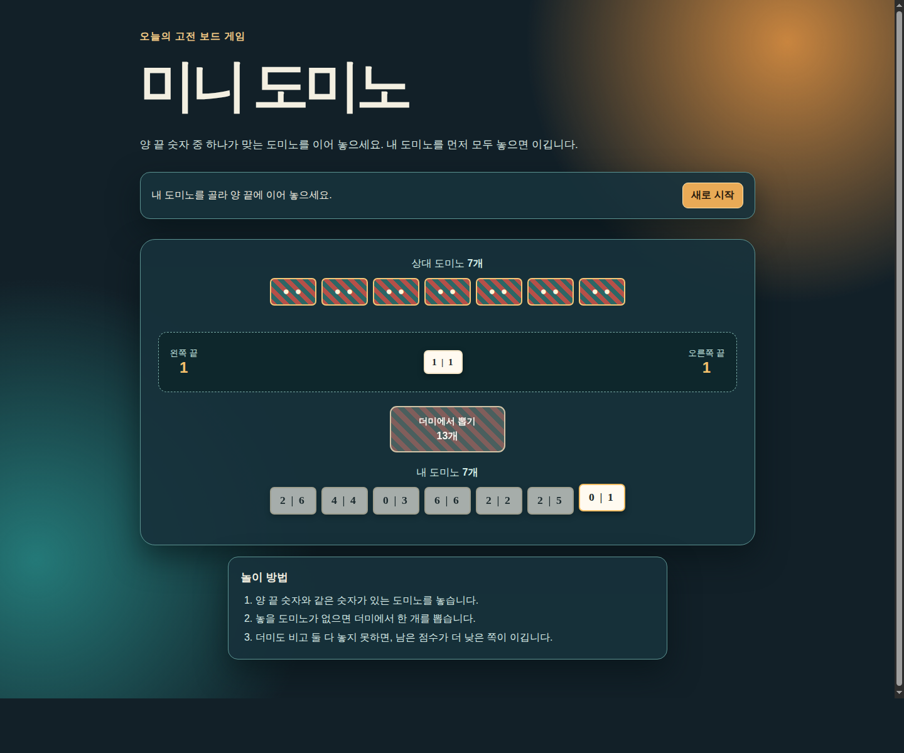
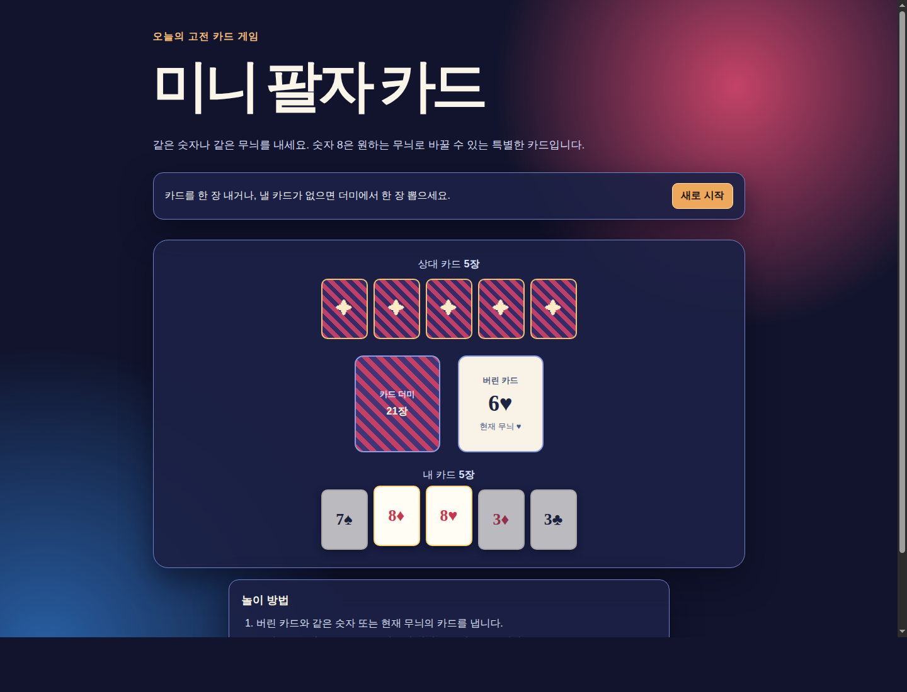
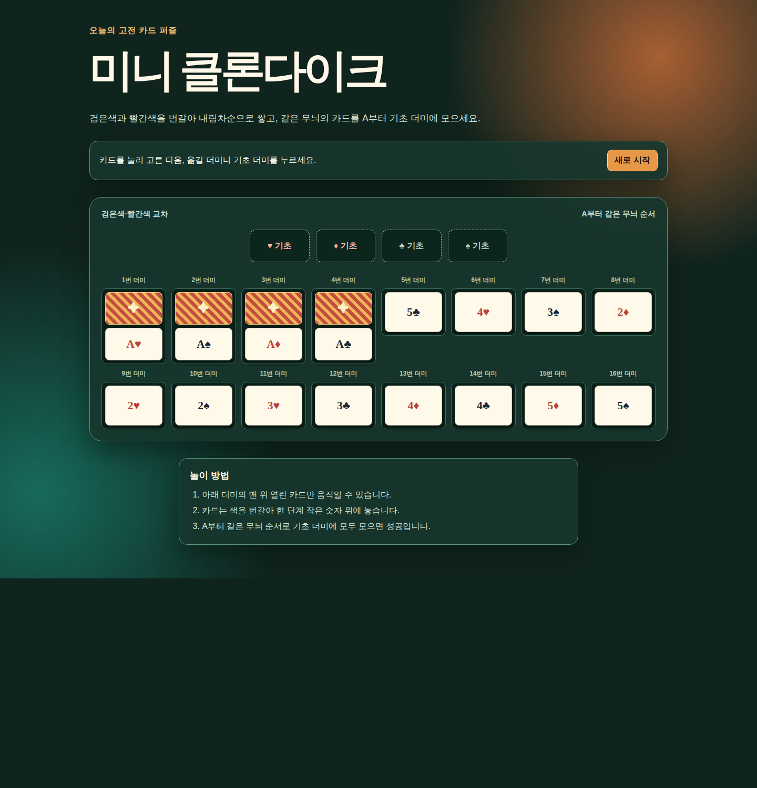
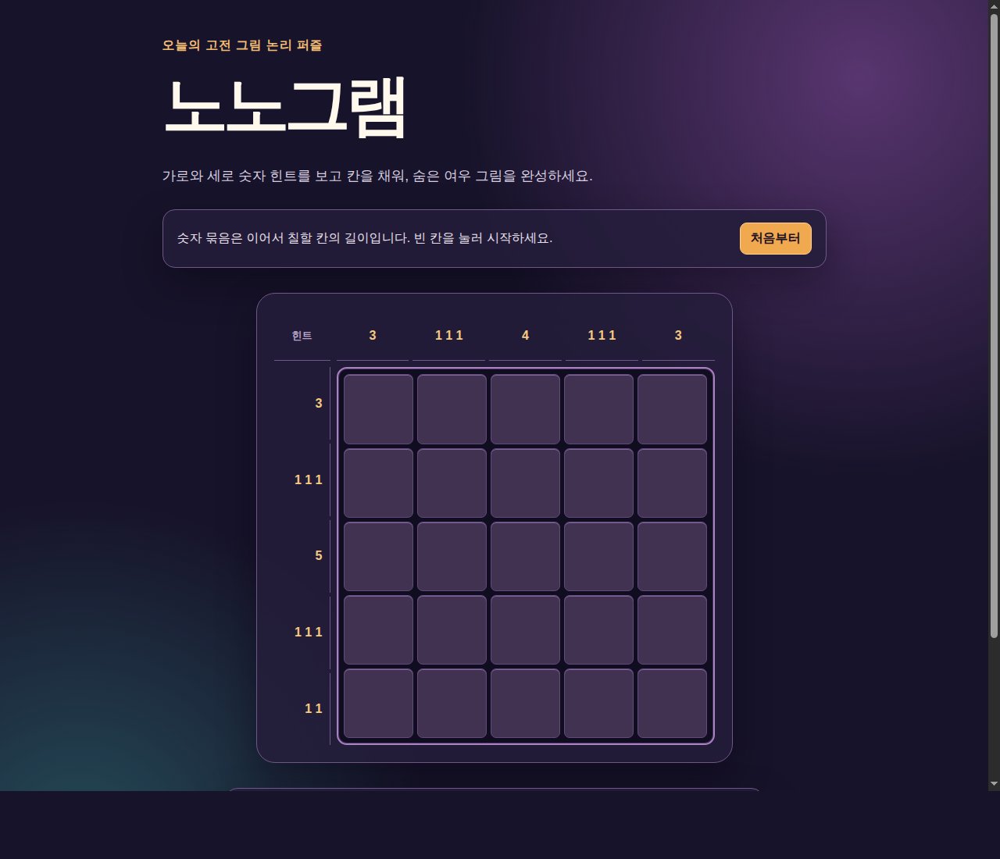
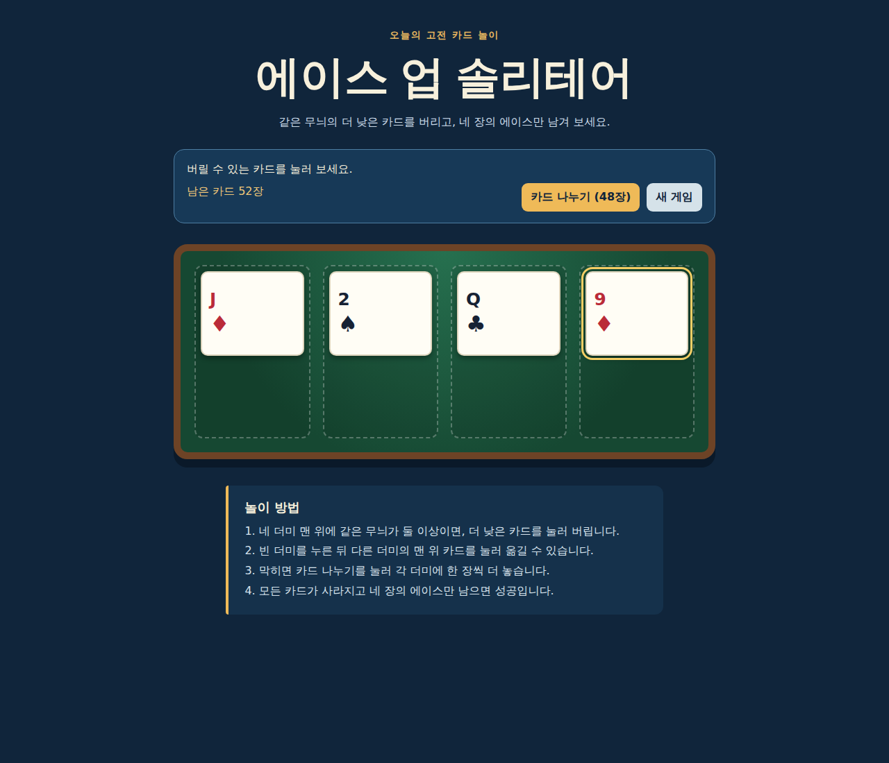
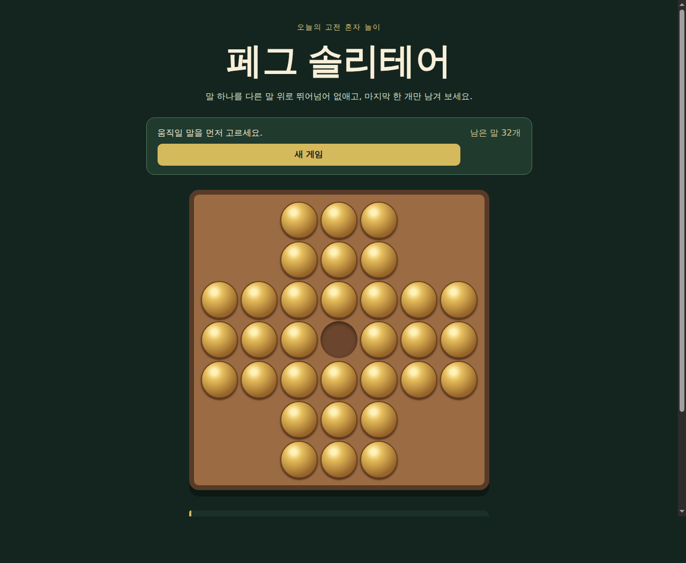
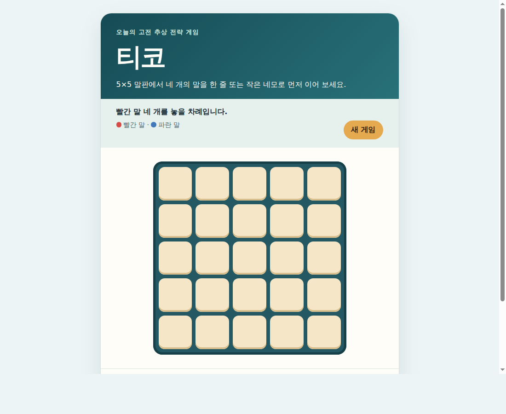
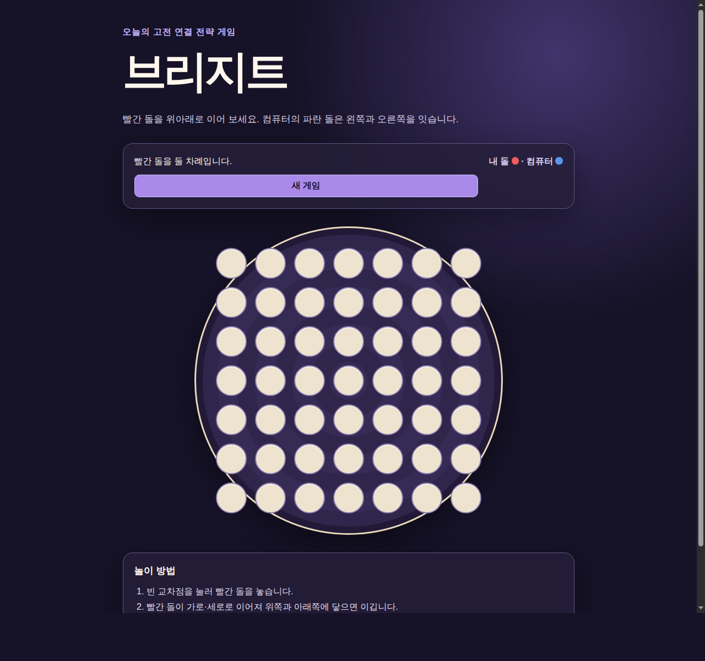
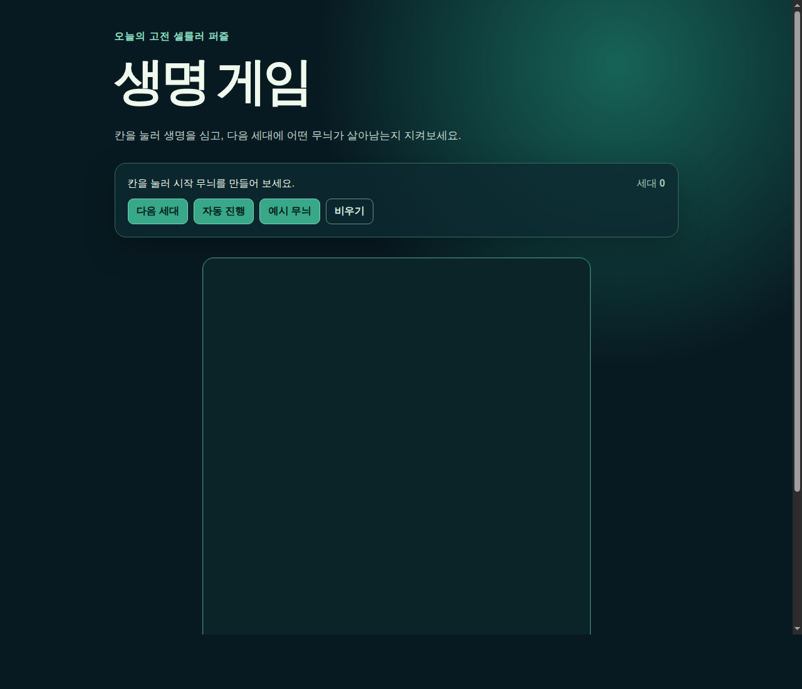
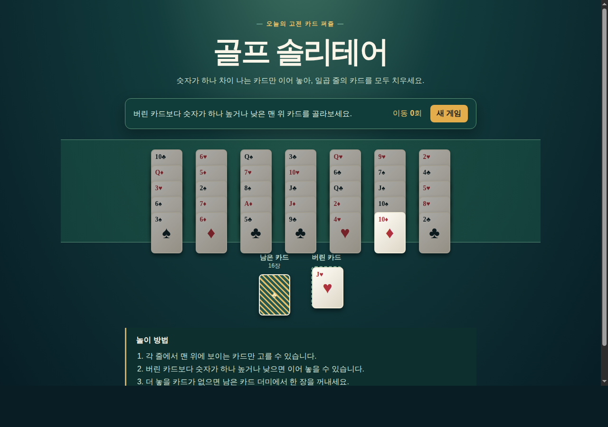

# 데일리 클래식 게임

날짜별로 작은 클래식 브라우저 게임을 모아두는 저장소입니다. 각 게임은 새 의존성 없이 정적 HTML, CSS, JavaScript만 사용합니다.

이전 게임 설명과 화면은 [아카이브](archive/README-games.md)에 보관합니다.

## 최근 게임 목록

| 날짜 | 게임 | 설명 |
| --- | --- | --- |
| 2026-08-23 | 미니 도미노 | 양 끝 숫자와 맞는 도미노를 이어 놓고, 내 도미노를 먼저 모두 없애는 고전 보드 게임입니다. |
| 2026-08-22 | 미니 팔자 카드 | 같은 숫자나 무늬의 카드를 내고, 언제든 낼 수 있는 팔자 카드로 다음 무늬를 바꿔 내 카드를 먼저 없애는 고전 카드 게임입니다. |
| 2026-08-21 | 미니 클론다이크 | 검은색과 빨간색 카드를 내림차순으로 쌓고, 같은 무늬의 카드를 A부터 기초 더미에 모으는 고전 카드 퍼즐입니다. |
| 2026-08-20 | 노노그램 | 가로와 세로 숫자 힌트를 보고 칸을 채워 숨은 여우 그림을 완성하는 고전 그림 논리 퍼즐입니다. |
| 2026-08-19 | 에이스 업 솔리테어 | 같은 무늬의 더 낮은 카드를 버리고 네 장의 에이스만 남기는 고전 카드 퍼즐입니다. |
| 2026-08-18 | 페그 솔리테어 | 십자형 말판에서 말을 하나 뛰어넘어 없애며, 마지막 말 하나만 남기는 고전 혼자 퍼즐입니다. |
| 2026-08-17 | 티코 | 5×5 말판에 빨간 말과 파란 말을 네 개씩 놓은 뒤 인접 칸으로 움직여, 가로·세로·대각선 네 칸 또는 2×2 네모를 먼저 만드는 고전 추상 전략 게임입니다. |
| 2026-08-16 | 브리지트 | 빨간 돌을 위아래로, 컴퓨터의 파란 돌을 왼쪽과 오른쪽으로 먼저 이어 승부하는 고전 연결 전략 게임입니다. |
| 2026-08-15 | 생명 게임 | 칸에 생명을 심고 이웃 수에 따라 다음 세대를 넘기며, 살아남고 태어나는 무늬를 관찰하는 고전 셀룰러 퍼즐입니다. |
| 2026-08-14 | 골프 솔리테어 | 버린 카드와 숫자가 하나 차이 나는 각 줄의 맨 위 카드만 이어 놓아, 일곱 줄을 모두 비우는 고전 카드 퍼즐입니다. |

## 최근 게임 화면

### 미니 도미노



### 미니 팔자 카드



### 미니 클론다이크



### 노노그램



### 에이스 업 솔리테어



### 페그 솔리테어



### 티코



### 브리지트



### 생명 게임



### 골프 솔리테어



## 테스트

로직 테스트는 Node.js 내장 모듈만 사용합니다.

```bash
node daily/2026-08-23-dominoes/game-logic.test.js
node daily/2026-08-22-crazy-eights/game-logic.test.js
node daily/2026-08-21-klondike-solitaire/game-logic.test.js
node daily/2026-08-20-nonogram/game-logic.test.js
node daily/2026-08-19-aces-up-solitaire/game-logic.test.js
node daily/2026-08-18-peg-solitaire/game-logic.test.js
node daily/2026-08-17-teeko/game-logic.test.js
node daily/2026-08-16-bridgit/game-logic.test.js
node daily/2026-08-15-game-of-life/game-logic.test.js
node daily/2026-08-14-golf-solitaire/game-logic.test.js
```
