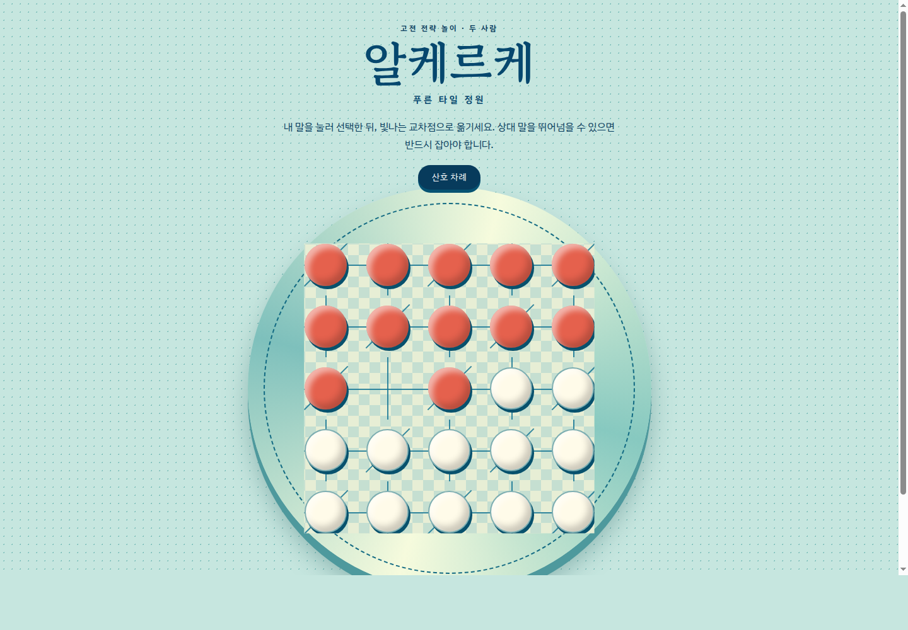
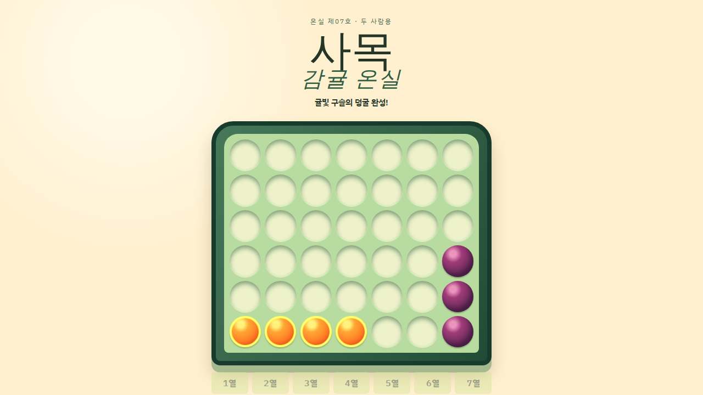
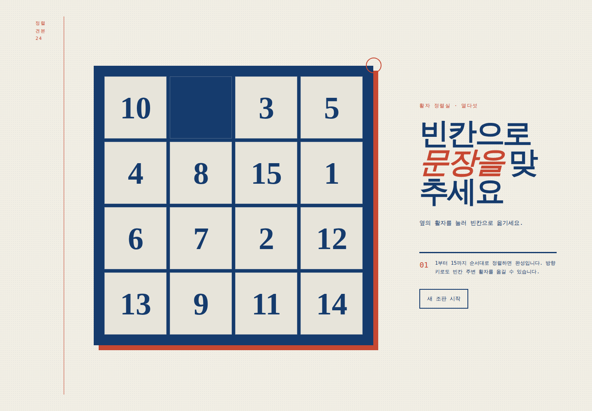
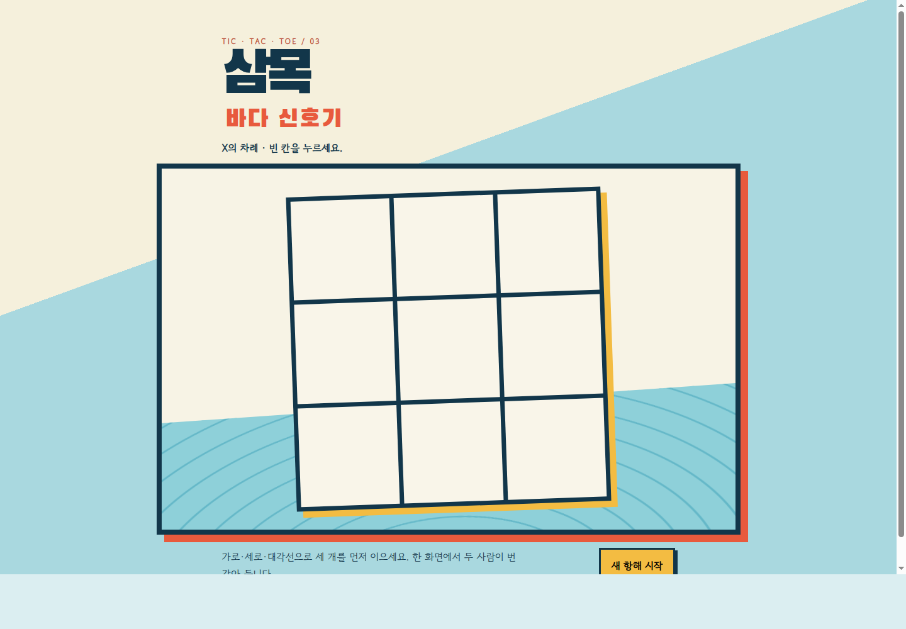
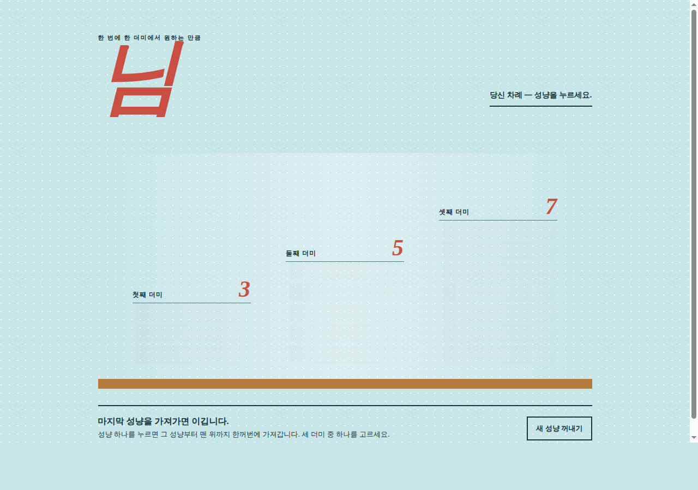
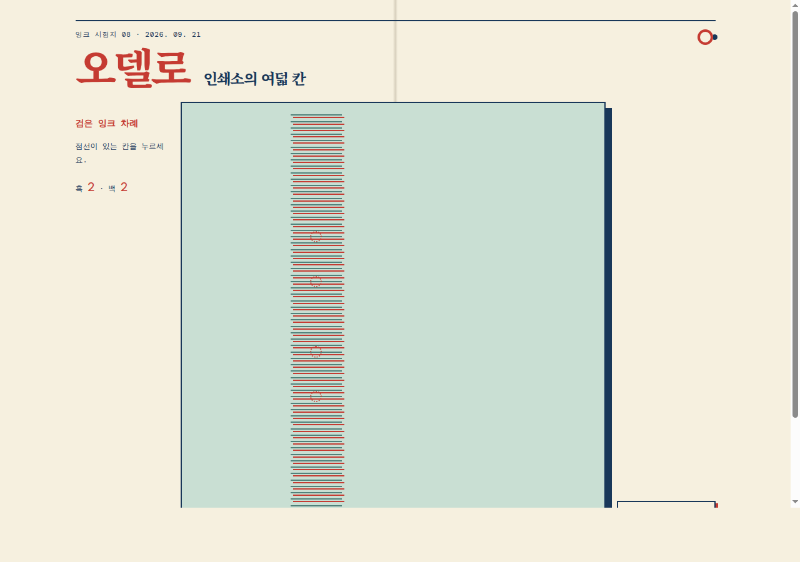
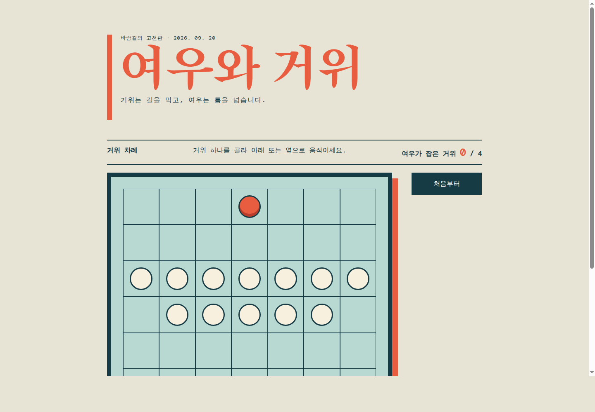
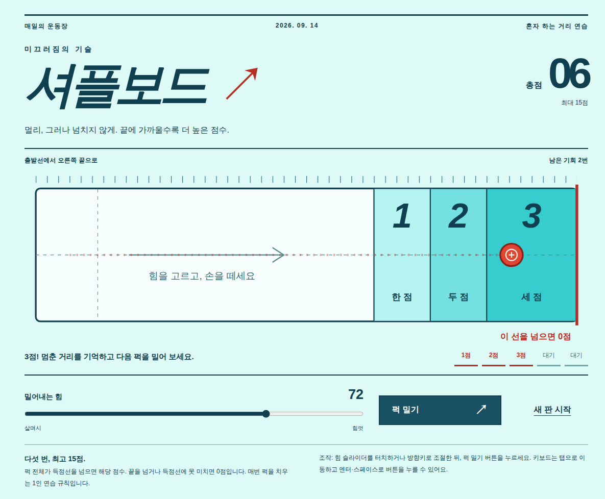
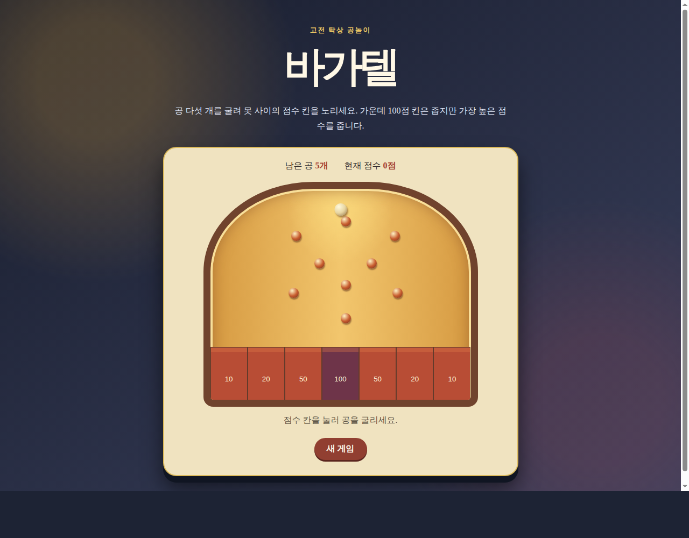
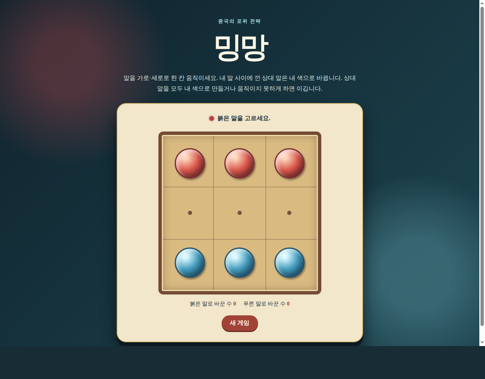

# 데일리 클래식 게임

날짜별로 작은 클래식 브라우저 게임을 모아두는 저장소입니다. 각 게임은 새 의존성 없이 정적 HTML, CSS, JavaScript만 사용합니다.

이전 게임 설명과 화면은 [아카이브](archive/README-games.md)에 보관합니다.

## 최근 게임 목록

| 날짜 | 게임 | 설명 |
| --- | --- | --- |
| 2026-09-26 | [알케르케 · 푸른 타일 정원](daily/2026-09-26-alquerque/index.html) | 산호와 상아 말을 교차점으로 움직여 상대 말을 뛰어넘어 잡고, 상대 말을 모두 없애는 두 사람용 고전 전략 게임입니다. |
| 2026-09-25 | [사목 · 감귤 온실](daily/2026-09-25-connect-four/index.html) | 귤빛과 자주빛 유리 구슬을 온실 격자에 떨어뜨려 가로·세로·대각선 네 알을 먼저 잇는 두 사람용 고전 사목 게임입니다. |
| 2026-09-24 | [열다섯 · 활자 정렬실](daily/2026-09-24-fifteen-puzzle/index.html) | 빈칸 옆의 번호 활자를 눌러 1부터 15까지 차례대로 정렬하는 한 사람용 고전 슬라이딩 퍼즐입니다. |
| 2026-09-23 | [삼목 · 바다 신호기](daily/2026-09-23-tic-tac-toe/index.html) | 청록 파도 위의 비스듬한 3×3 표지판에서 X와 O를 번갈아 놓아 세 칸을 먼저 잇는 두 사람용 고전 게임입니다. |
| 2026-09-22 | [님 · 성냥 공방](daily/2026-09-22-nim-sticks/index.html) | 세 더미에서 한 더미를 골라 성냥을 원하는 만큼 가져가며 컴퓨터보다 먼저 마지막 성냥을 차지하는 고전 전략 게임입니다. |
| 2026-09-21 | [오델로 · 인쇄소의 여덟 칸](daily/2026-09-21-othello-print-studio/index.html) | 흑과 백의 잉크를 번갈아 찍어 상대 돌을 사이에 끼우고 뒤집으며, 더 많은 돌을 남기는 두 사람용 고전 전략 게임입니다. |
| 2026-09-20 | [여우와 거위 · 바람길](daily/2026-09-20-fox-and-geese/index.html) | 거위는 길을 막고 여우는 거위를 넘어 잡으며, 여우가 네 마리를 먼저 잡으면 이기는 두 사람용 고전 포위 전략 게임입니다. |
| 2026-09-14 | [셔플보드 · 미끄러짐의 기술](daily/2026-09-14-shuffleboard/index.html) | 힘을 조절해 퍽을 오른쪽 득점 구역으로 밀고, 끝을 넘지 않도록 다섯 번의 거리 감각을 겨루는 1인 연습 게임입니다. |
| 2026-09-13 | [바가텔 · 작은 유원지](daily/2026-09-13-bagatelle/index.html) | 목재 오락기의 용수철로 쇠구슬 다섯 개를 쏘아 올리고, 못과 벽에 튕겨 도착한 홈의 점수를 모으는 물리 공놀이입니다. |
| 2026-09-12 | 밍망 | 말을 가로·세로로 한 칸 움직여 내 말 사이에 낀 상대 말을 내 색으로 바꾸고, 상대 말을 모두 바꾸거나 움직이지 못하게 만드는 중국의 고전 포위 전략 게임입니다. |

## 최근 게임 화면

### 알케르케 · 푸른 타일 정원



[게임 파일](daily/2026-09-26-alquerque/index.html) · [모바일 화면](daily/2026-09-26-alquerque/screenshot-mobile.png) · [디자인 비교와 검증](daily/2026-09-26-alquerque/DESIGN.md)

### 사목 · 감귤 온실



[게임 파일](daily/2026-09-25-connect-four/index.html) · [모바일 화면](daily/2026-09-25-connect-four/screenshot-mobile.png) · [디자인 비교와 검증](daily/2026-09-25-connect-four/DESIGN.md)

### 열다섯 · 활자 정렬실



[게임 파일](daily/2026-09-24-fifteen-puzzle/index.html) · [모바일 화면](daily/2026-09-24-fifteen-puzzle/screenshot-mobile.png) · [디자인 비교와 검증](daily/2026-09-24-fifteen-puzzle/DESIGN.md)

### 삼목 · 바다 신호기



[게임 파일](daily/2026-09-23-tic-tac-toe/index.html) · [모바일 화면](daily/2026-09-23-tic-tac-toe/screenshot-mobile.png) · [디자인 비교와 검증](daily/2026-09-23-tic-tac-toe/DESIGN.md)

### 님 · 성냥 공방



[게임 파일](daily/2026-09-22-nim-sticks/index.html) · [모바일 화면](daily/2026-09-22-nim-sticks/screenshot-mobile.png) · [디자인 비교와 검증](daily/2026-09-22-nim-sticks/DESIGN.md)

### 오델로 · 인쇄소의 여덟 칸



[게임 파일](daily/2026-09-21-othello-print-studio/index.html) · [모바일 화면](daily/2026-09-21-othello-print-studio/screenshot-mobile.png) · [디자인 비교와 검증](daily/2026-09-21-othello-print-studio/DESIGN.md)

### 여우와 거위 · 바람길



[게임 파일](daily/2026-09-20-fox-and-geese/index.html) · [모바일 화면](daily/2026-09-20-fox-and-geese/screenshot-mobile.png) · [디자인 비교와 검증](daily/2026-09-20-fox-and-geese/DESIGN.md)

### 셔플보드 · 미끄러짐의 기술



[게임 파일](daily/2026-09-14-shuffleboard/index.html) · [모바일 화면](daily/2026-09-14-shuffleboard/screenshot-mobile.png) · [디자인 비교와 검증](daily/2026-09-14-shuffleboard/DESIGN.md)

퍽 전체가 1·2·3점 선을 넘어 멈추면 득점합니다. 끝을 넘으면 0점, 매번 퍽을 치우며 다섯 번의 점수를 합산합니다.

### 바가텔 · 작은 유원지



[게임 열기](https://raw.githack.com/qoxmfaktmxj/codex-test/7fa5337795768dbc3435b0094e57fe448f2ad2c7/daily/2026-09-13-bagatelle/index.html) · [모바일 화면](daily/2026-09-13-bagatelle/screenshot-mobile.png) · [디자인 비교와 검증](daily/2026-09-13-bagatelle/DESIGN.md)

첫 접속 시 외부 뷰어 안내의 **Open the page**를 누르면 게임이 열립니다.

### 밍망



## 테스트

로직 테스트는 Node.js 내장 모듈만 사용합니다.

```bash
node daily/2026-09-26-alquerque/game-logic.test.js
node daily/2026-09-25-connect-four/game-logic.test.js
node daily/2026-09-24-fifteen-puzzle/game-logic.test.js
node daily/2026-09-23-tic-tac-toe/game-logic.test.js
node daily/2026-09-22-nim-sticks/game-logic.test.js
node daily/2026-09-21-othello-print-studio/game-logic.test.js
node daily/2026-09-20-fox-and-geese/game-logic.test.js
node daily/2026-09-14-shuffleboard/game-logic.test.js
node daily/2026-09-13-bagatelle/game-logic.test.js
node daily/2026-09-12-ming-mang/game-logic.test.js
node daily/2026-09-11-awithlaknannai/game-logic.test.js
node daily/2026-09-10-mini-fanorona/game-logic.test.js
node daily/2026-09-09-umul-gonu/game-logic.test.js
node daily/2026-09-08-latrunculi/game-logic.test.js
node daily/2026-09-07-shisima/game-logic.test.js
node daily/2026-09-06-mini-hasami-shogi/game-logic.test.js
node daily/2026-09-05-seega/game-logic.test.js
node daily/2026-09-04-mini-halma/game-logic.test.js
node daily/2026-09-03-frog-leap/game-logic.test.js
node daily/2026-09-02-yote/game-logic.test.js
node daily/2026-09-01-dara/game-logic.test.js
node daily/2026-08-31-picaria/game-logic.test.js
node daily/2026-08-30-chopsticks/game-logic.test.js
node daily/2026-08-29-six-mens-morris/game-logic.test.js
node daily/2026-08-28-five-field-kono/game-logic.test.js
node daily/2026-08-27-tafl/game-logic.test.js
node daily/2026-08-26-gaps-solitaire/game-logic.test.js
node daily/2026-08-25-quarto/game-logic.test.js
node daily/2026-08-24-mini-freecell/game-logic.test.js
node daily/2026-08-23-dominoes/game-logic.test.js
node daily/2026-08-22-crazy-eights/game-logic.test.js
node daily/2026-08-21-klondike-solitaire/game-logic.test.js
node daily/2026-08-20-nonogram/game-logic.test.js
node daily/2026-08-19-aces-up-solitaire/game-logic.test.js
node daily/2026-08-18-peg-solitaire/game-logic.test.js
node daily/2026-08-17-teeko/game-logic.test.js
```
