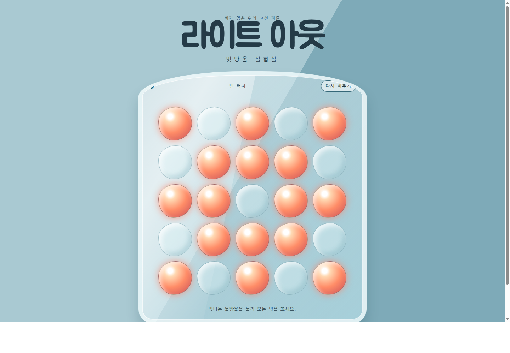
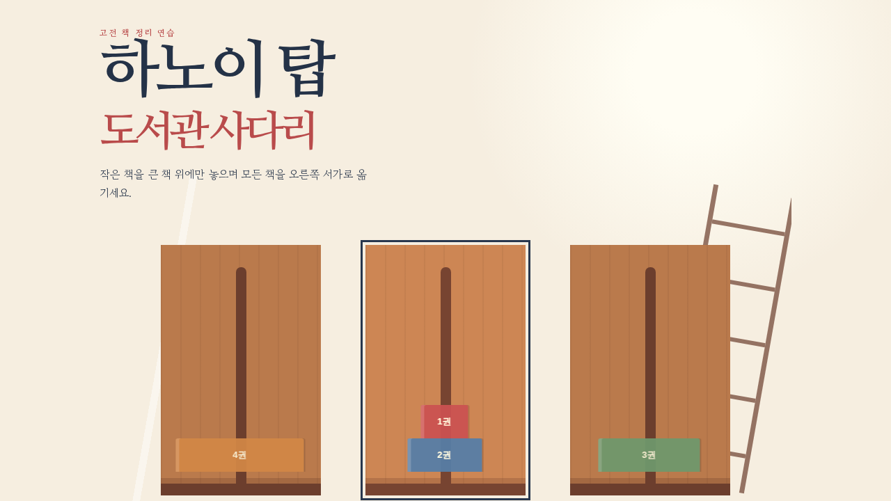
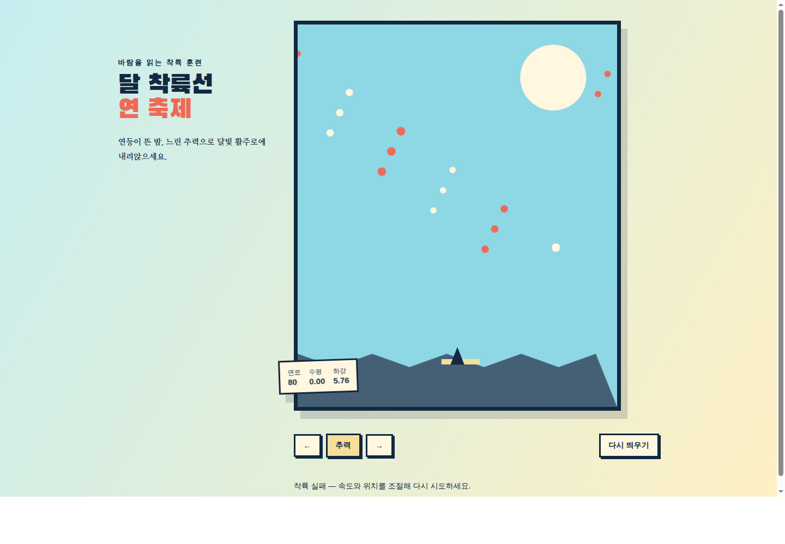
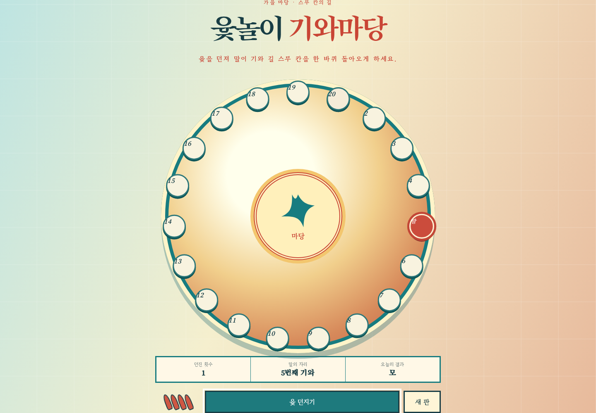
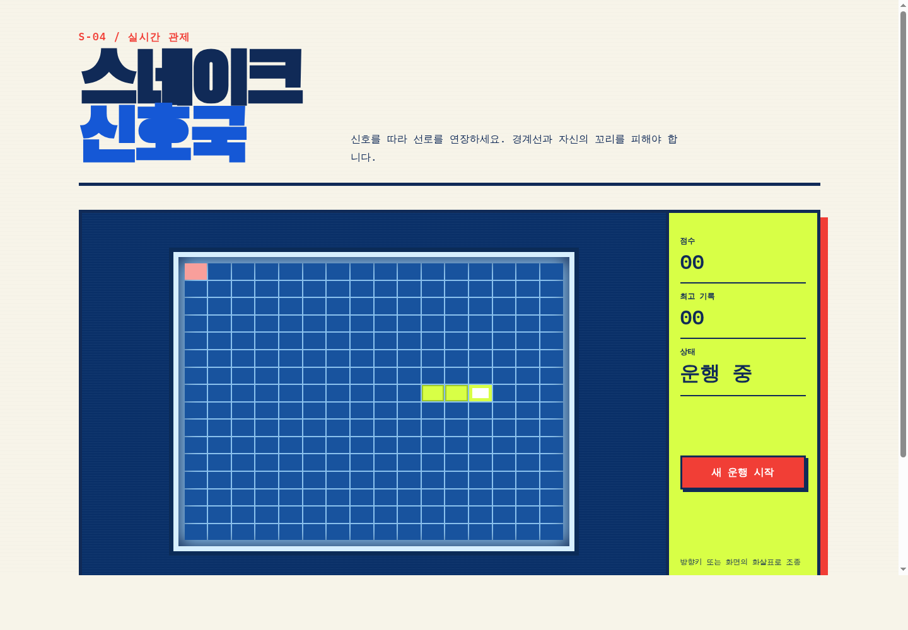
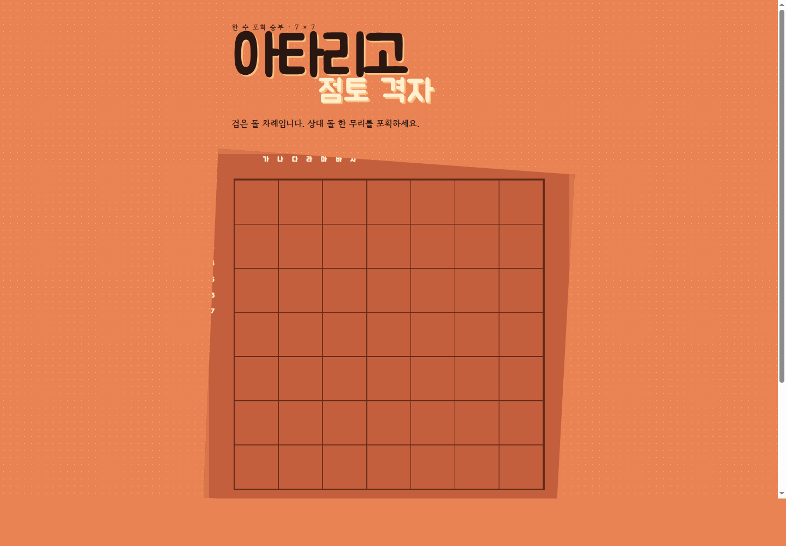
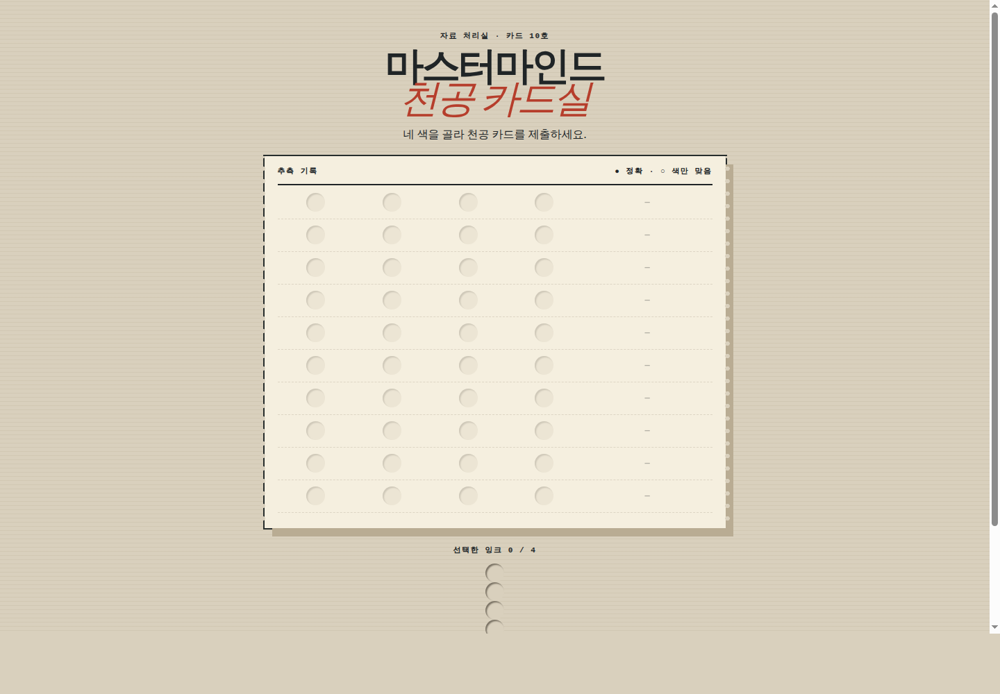
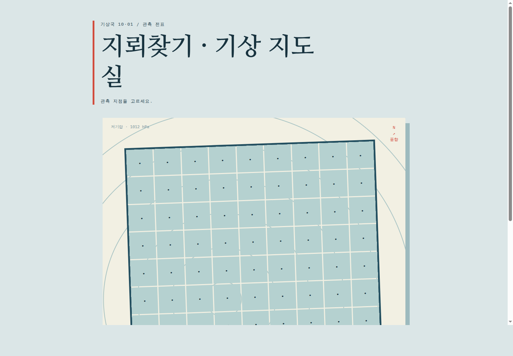
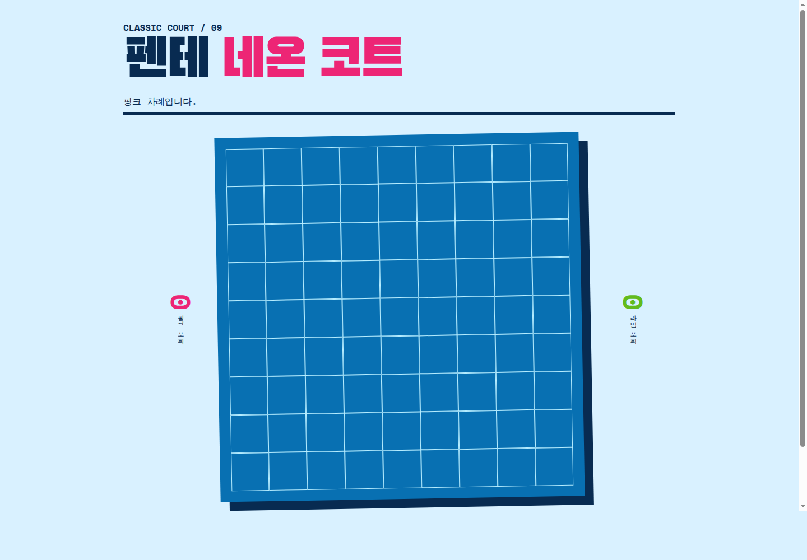

# 데일리 클래식 게임

날짜별로 작은 클래식 브라우저 게임을 모아두는 저장소입니다. 각 게임은 새 의존성 없이 정적 HTML, CSS, JavaScript만 사용합니다.

이전 게임 설명과 화면은 [아카이브](archive/README-games.md)에 보관합니다.

## 최근 게임 목록

| 날짜 | 게임 | 설명 |
| --- | --- | --- |
| 2026-10-09 | [라이트 아웃 · 빗방울 실험실](daily/2026-10-09-lights-out-rain-lab/index.html) | 비 내린 유리창의 빛나는 물방울을 눌러 십자 모양 이웃과 함께 모두 끄는 고전 라이트 아웃 퍼즐입니다. |
| 2026-10-08 | [하노이 탑 · 도서관 사다리](daily/2026-10-08-hanoi-library-ladder/index.html) | 밝은 도서관의 세 서가에서 작은 책을 큰 책 위에만 놓아 오른쪽 서가로 모두 옮기는 고전 하노이 탑 퍼즐입니다. |
| 2026-10-07 | [달 착륙선 · 연 축제](daily/2026-10-07-lunar-lander-kite-festival/index.html) | 연등이 뜬 청록 하늘에서 추력과 수평 속도를 조절해 달빛 활주로에 내려앉는 고전 달 착륙 게임입니다. |
| 2026-10-06 | [윷놀이 · 기와마당](daily/2026-10-06-yutnori-roofyard/index.html) | 기와가 깔린 둥근 마당에서 윷을 던져 말을 한 바퀴 돌아오게 하는 한국의 고전 놀이입니다. |
| 2026-10-05 | [2048 · 활자 인쇄소](daily/2026-10-05-2048-printshop/index.html) | 같은 숫자 활자를 밀어 한 장의 큰 숫자로 조판하며 2048호를 찍는 고전 숫자 퍼즐입니다. |
| 2026-10-04 | [스네이크 · 신호국](daily/2026-10-04-snake-signal/index.html) | CRT 신호 모니터에서 방향키로 선로를 연장하며 사과 신호를 모으고, 벽과 자신의 꼬리를 피하는 고전 스네이크입니다. |
| 2026-10-03 | [아타리고 · 점토 격자](daily/2026-10-03-atari-go-clay-grid/index.html) | 한 번의 포획으로 끝나는 7×7 아타리고에서 점토 격자의 교차점에 흑백 돌을 두는 두 사람용 고전 전략 게임입니다. |
| 2026-10-02 | [마스터마인드 · 천공 카드실](daily/2026-10-02-mastermind-punchcard/index.html) | 여섯 잉크색으로 된 네 칸의 비밀 암호를 천공 카드에 기록하고, 정확한 자리와 색 힌트로 해독하는 고전 추리 게임입니다. |
| 2026-10-01 | [지뢰찾기 · 기상 지도실](daily/2026-10-01-minesweeper-weather-map/index.html) | 종이 일기도 위의 관측 지점을 열어 폭풍을 피해 모든 안전 지점을 찾는 고전 지뢰찾기입니다. |
| 2026-09-30 | [펜테 · 네온 코트](daily/2026-09-30-pente-neon-court/index.html) | 형광 코트 위에서 돌 다섯 개를 잇거나 상대 돌을 포획하는 두 사람용 고전 펜테입니다. |
| 2026-09-29 | [보글 · 활자 상자](daily/2026-09-29-boggle-typecase/index.html) | 서로 닿은 한글 활자를 이어 목록의 낱말을 조판하듯 찾아내는 고전 낱말 퍼즐입니다. |

## 최근 게임 화면

### 라이트 아웃 · 빗방울 실험실



[게임 파일](daily/2026-10-09-lights-out-rain-lab/index.html) · [모바일 화면](daily/2026-10-09-lights-out-rain-lab/screenshot-mobile.png) · [디자인 비교와 검증](daily/2026-10-09-lights-out-rain-lab/DESIGN.md)

### 하노이 탑 · 도서관 사다리



[게임 파일](daily/2026-10-08-hanoi-library-ladder/index.html) · [모바일 화면](daily/2026-10-08-hanoi-library-ladder/screenshot-mobile.png) · [디자인 비교와 검증](daily/2026-10-08-hanoi-library-ladder/DESIGN.md)

### 달 착륙선 · 연 축제



[게임 파일](daily/2026-10-07-lunar-lander-kite-festival/index.html) · [모바일 화면](daily/2026-10-07-lunar-lander-kite-festival/screenshot-mobile.png) · [디자인 비교와 검증](daily/2026-10-07-lunar-lander-kite-festival/DESIGN.md)

### 윷놀이 · 기와마당



[게임 파일](daily/2026-10-06-yutnori-roofyard/index.html) · [모바일 화면](daily/2026-10-06-yutnori-roofyard/screenshot-mobile.png) · [디자인 비교와 검증](daily/2026-10-06-yutnori-roofyard/DESIGN.md)

### 2048 · 활자 인쇄소


[게임 파일](daily/2026-10-05-2048-printshop/index.html) · [모바일 화면](daily/2026-10-05-2048-printshop/screenshot-mobile.png) · [디자인 비교와 검증](daily/2026-10-05-2048-printshop/DESIGN.md)

### 스네이크 · 신호국



[게임 파일](daily/2026-10-04-snake-signal/index.html) · [모바일 화면](daily/2026-10-04-snake-signal/screenshot-mobile.png) · [디자인 비교와 검증](daily/2026-10-04-snake-signal/DESIGN.md)

### 아타리고 · 점토 격자



[게임 파일](daily/2026-10-03-atari-go-clay-grid/index.html) · [모바일 화면](daily/2026-10-03-atari-go-clay-grid/screenshot-mobile.png) · [디자인 비교와 검증](daily/2026-10-03-atari-go-clay-grid/DESIGN.md)

### 마스터마인드 · 천공 카드실



[게임 파일](daily/2026-10-02-mastermind-punchcard/index.html) · [모바일 화면](daily/2026-10-02-mastermind-punchcard/screenshot-mobile.png) · [디자인 비교와 검증](daily/2026-10-02-mastermind-punchcard/DESIGN.md)

### 지뢰찾기 · 기상 지도실



[게임 파일](daily/2026-10-01-minesweeper-weather-map/index.html) · [모바일 화면](daily/2026-10-01-minesweeper-weather-map/screenshot-mobile.png) · [디자인 비교와 검증](daily/2026-10-01-minesweeper-weather-map/DESIGN.md)

### 펜테 · 네온 코트



[게임 파일](daily/2026-09-30-pente-neon-court/index.html) · [모바일 화면](daily/2026-09-30-pente-neon-court/screenshot-mobile.png) · [디자인 비교와 검증](daily/2026-09-30-pente-neon-court/DESIGN.md)

## 테스트

로직 테스트는 Node.js 내장 모듈만 사용합니다.

```bash
node daily/2026-10-09-lights-out-rain-lab/game-logic.test.js
node daily/2026-10-08-hanoi-library-ladder/game-logic.test.js
node daily/2026-10-07-lunar-lander-kite-festival/game-logic.test.js
node daily/2026-10-06-yutnori-roofyard/game-logic.test.js
node daily/2026-10-05-2048-printshop/game-logic.test.js
node daily/2026-10-04-snake-signal/game-logic.test.js
node daily/2026-10-03-atari-go-clay-grid/game-logic.test.js
node daily/2026-10-02-mastermind-punchcard/game-logic.test.js
node daily/2026-10-01-minesweeper-weather-map/game-logic.test.js
node daily/2026-09-30-pente-neon-court/game-logic.test.js
node daily/2026-09-29-boggle-typecase/game-logic.test.js
node daily/2026-09-28-kalaha-tide-pools/game-logic.test.js
node daily/2026-09-27-mini-draughts/game-logic.test.js
node daily/2026-09-26-alquerque/game-logic.test.js
node daily/2026-09-25-connect-four/game-logic.test.js
node daily/2026-09-24-fifteen-puzzle/game-logic.test.js
node daily/2026-09-23-tic-tac-toe/game-logic.test.js
node daily/2026-09-22-nim-sticks/game-logic.test.js
node daily/2026-09-20-fox-and-geese/game-logic.test.js
node daily/2026-09-14-shuffleboard/game-logic.test.js
node daily/2026-09-13-bagatelle/game-logic.test.js
node daily/2026-09-12-ming-mang/game-logic.test.js
node daily/2026-09-11-awithlaknannai/game-logic.test.js
node daily/2026-09-10-mini-fanorona/game-logic.test.js
node daily/2026-09-09-umul-gonu/game-logic.test.js
node daily/2026-09-08-latrunculi/game-logic.test.js
node daily/2026-09-07-shisima/game-logic.test.js
node daily/2026-09-06-mini-hasami-shogi/game-logic.test.js
node daily/2026-09-05-seega/game-logic.test.js
node daily/2026-09-04-mini-halma/game-logic.test.js
node daily/2026-09-03-frog-leap/game-logic.test.js
node daily/2026-09-02-yote/game-logic.test.js
node daily/2026-09-01-dara/game-logic.test.js
node daily/2026-08-31-picaria/game-logic.test.js
node daily/2026-08-30-chopsticks/game-logic.test.js
node daily/2026-08-29-six-mens-morris/game-logic.test.js
node daily/2026-08-28-five-field-kono/game-logic.test.js
node daily/2026-08-27-tafl/game-logic.test.js
node daily/2026-08-26-gaps-solitaire/game-logic.test.js
node daily/2026-08-25-quarto/game-logic.test.js
node daily/2026-08-24-mini-freecell/game-logic.test.js
node daily/2026-08-23-dominoes/game-logic.test.js
node daily/2026-08-22-crazy-eights/game-logic.test.js
node daily/2026-08-21-klondike-solitaire/game-logic.test.js
node daily/2026-08-20-nonogram/game-logic.test.js
node daily/2026-08-19-aces-up-solitaire/game-logic.test.js
node daily/2026-08-18-peg-solitaire/game-logic.test.js
node daily/2026-08-17-teeko/game-logic.test.js
```
