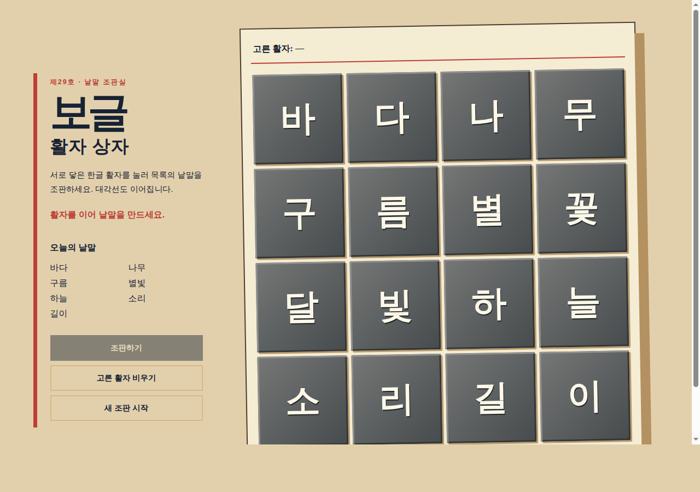
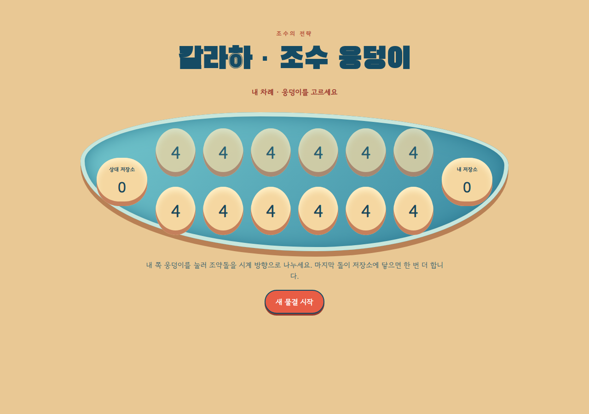
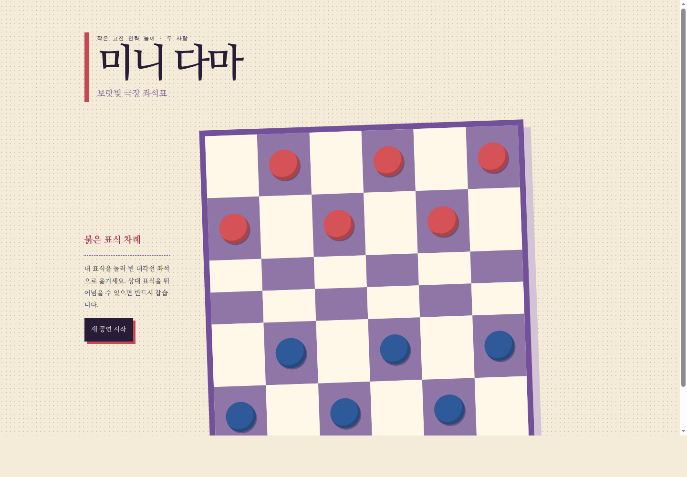
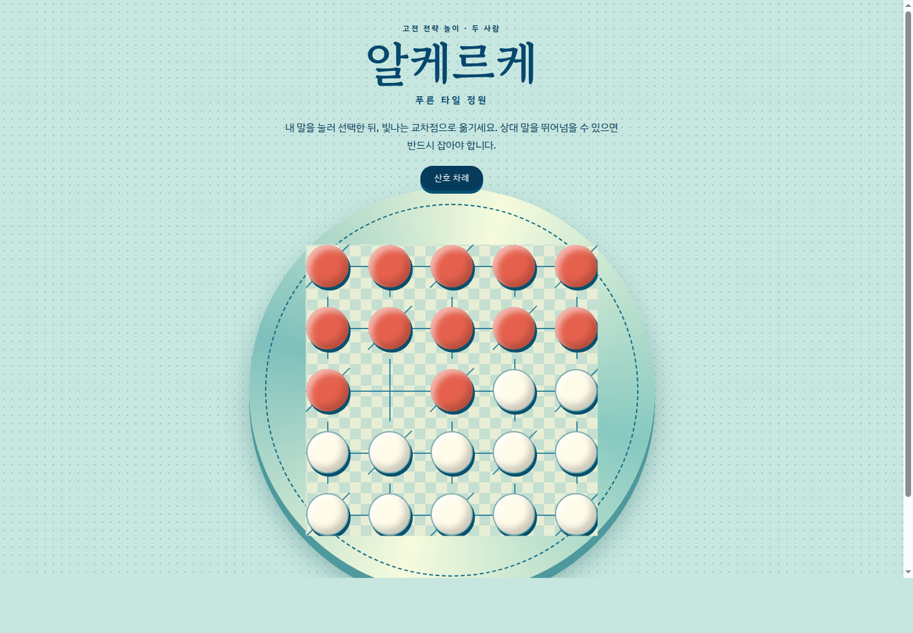
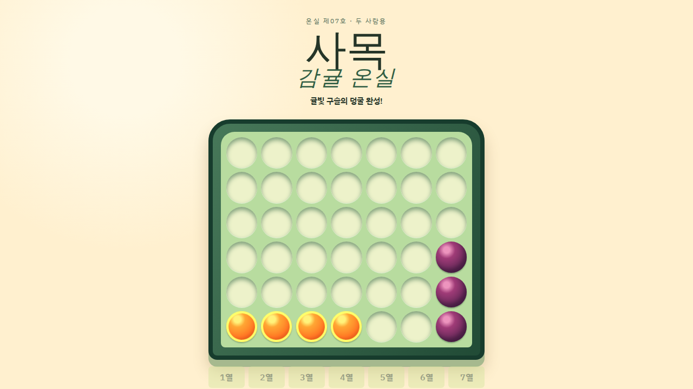
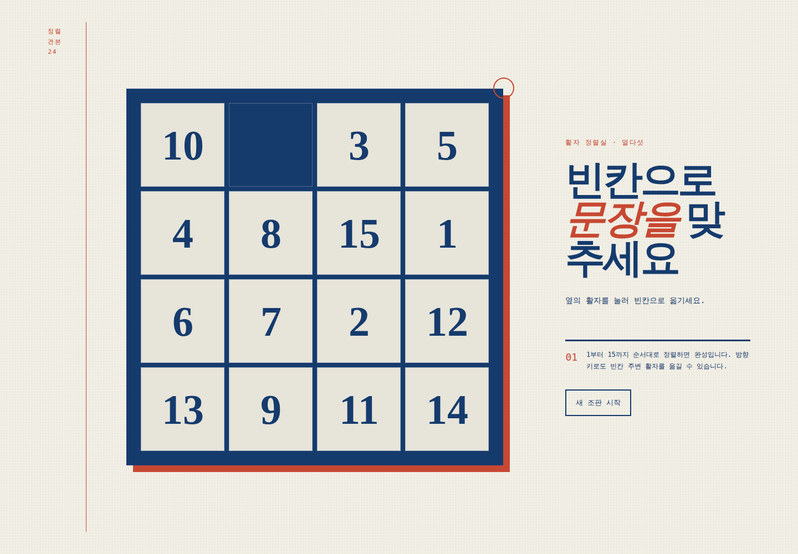
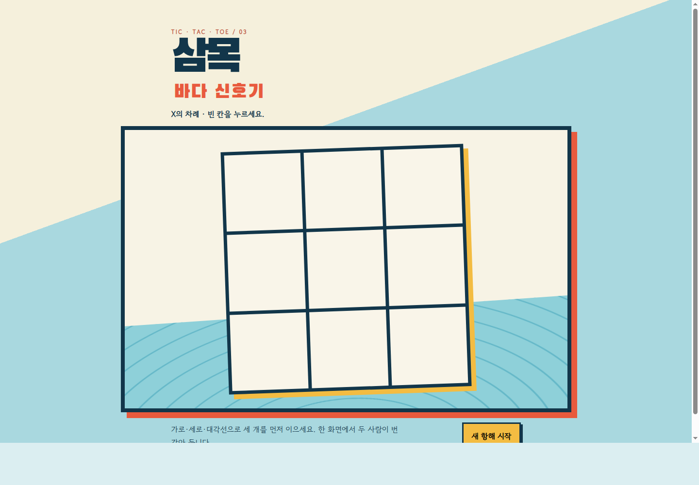
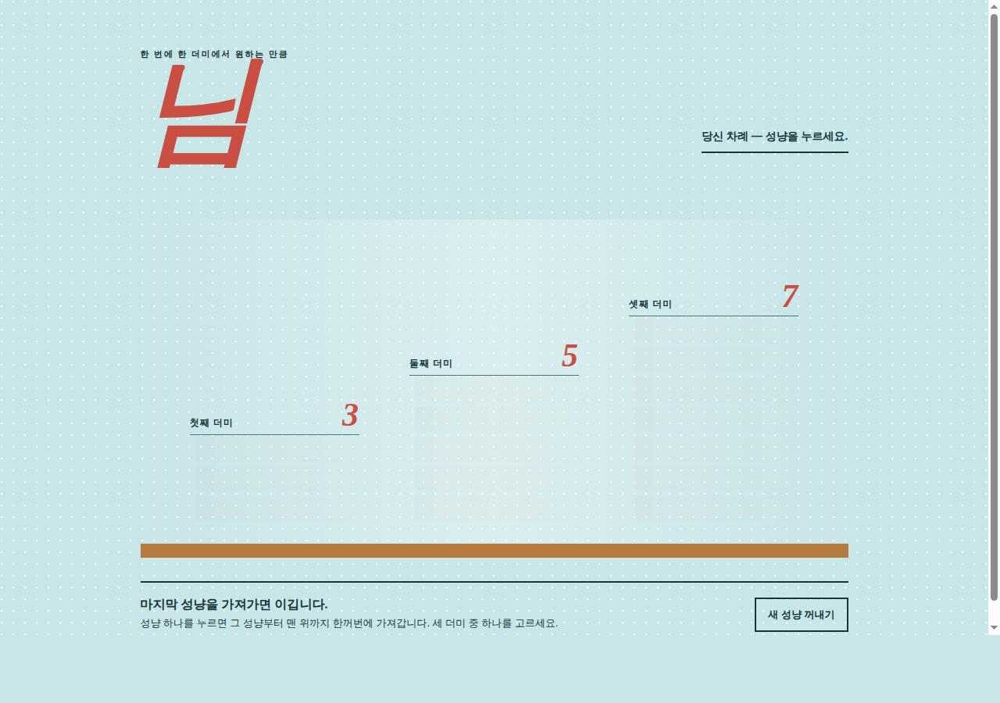
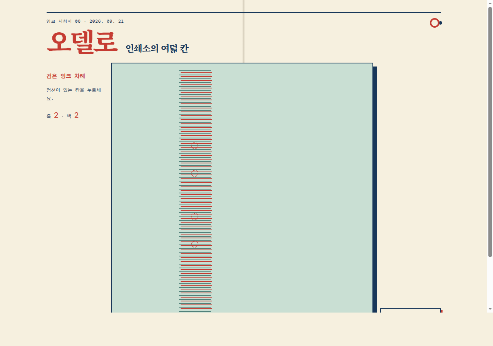

# 데일리 클래식 게임

날짜별로 작은 클래식 브라우저 게임을 모아두는 저장소입니다. 각 게임은 새 의존성 없이 정적 HTML, CSS, JavaScript만 사용합니다.

이전 게임 설명과 화면은 [아카이브](archive/README-games.md)에 보관합니다.

## 최근 게임 목록

| 날짜 | 게임 | 설명 |
| --- | --- | --- |
| 2026-09-30 | [펜테 · 네온 코트](daily/2026-09-30-pente-neon-court/index.html) | 형광 코트 위에서 돌 다섯 개를 잇거나 상대 돌을 포획하는 두 사람용 고전 펜테입니다. |
| 2026-09-29 | [보글 · 활자 상자](daily/2026-09-29-boggle-typecase/index.html) | 서로 닿은 한글 활자를 이어 목록의 낱말을 조판하듯 찾아내는 고전 낱말 퍼즐입니다. |
| 2026-09-28 | [칼라하 · 조수 웅덩이](daily/2026-09-28-kalaha-tide-pools/index.html) | 내 쪽 조약돌을 시계 방향으로 나누어 저장소에 모으고, 마지막 돌의 위치를 계산해 추가 턴과 포획을 노리는 고전 전략 게임입니다. |
| 2026-09-27 | [미니 다마 · 보랏빛 극장 좌석표](daily/2026-09-27-mini-draughts/index.html) | 붉은 표식과 푸른 표식을 대각선 좌석으로 옮기고 상대를 뛰어넘어 모두 잡는 두 사람용 미니 다마입니다. |
| 2026-09-26 | [알케르케 · 푸른 타일 정원](daily/2026-09-26-alquerque/index.html) | 산호와 상아 말을 교차점으로 움직여 상대 말을 뛰어넘어 잡고, 상대 말을 모두 없애는 두 사람용 고전 전략 게임입니다. |
| 2026-09-25 | [사목 · 감귤 온실](daily/2026-09-25-connect-four/index.html) | 귤빛과 자주빛 유리 구슬을 온실 격자에 떨어뜨려 가로·세로·대각선 네 알을 먼저 잇는 두 사람용 고전 사목 게임입니다. |
| 2026-09-24 | [열다섯 · 활자 정렬실](daily/2026-09-24-fifteen-puzzle/index.html) | 빈칸 옆의 번호 활자를 눌러 1부터 15까지 차례대로 정렬하는 한 사람용 고전 슬라이딩 퍼즐입니다. |
| 2026-09-23 | [삼목 · 바다 신호기](daily/2026-09-23-tic-tac-toe/index.html) | 청록 파도 위의 비스듬한 3×3 표지판에서 X와 O를 번갈아 놓아 세 칸을 먼저 잇는 두 사람용 고전 게임입니다. |
| 2026-09-22 | [님 · 성냥 공방](daily/2026-09-22-nim-sticks/index.html) | 세 더미에서 한 더미를 골라 성냥을 원하는 만큼 가져가며 컴퓨터보다 먼저 마지막 성냥을 차지하는 고전 전략 게임입니다. |
| 2026-09-21 | [오델로 · 인쇄소의 여덟 칸](daily/2026-09-21-othello-print-studio/index.html) | 흑과 백의 잉크를 번갈아 찍어 상대 돌을 사이에 끼우고 뒤집으며, 더 많은 돌을 남기는 두 사람용 고전 전략 게임입니다. |

## 최근 게임 화면

### 펜테 · 네온 코트


[게임 파일](daily/2026-09-30-pente-neon-court/index.html) · [모바일 화면](daily/2026-09-30-pente-neon-court/screenshot-mobile.png) · [디자인 비교와 검증](daily/2026-09-30-pente-neon-court/DESIGN.md)

### 보글 · 활자 상자



[게임 파일](daily/2026-09-29-boggle-typecase/index.html) · [모바일 화면](daily/2026-09-29-boggle-typecase/screenshot-mobile.png) · [디자인 비교와 검증](daily/2026-09-29-boggle-typecase/DESIGN.md)

### 칼라하 · 조수 웅덩이



[게임 파일](daily/2026-09-28-kalaha-tide-pools/index.html) · [모바일 화면](daily/2026-09-28-kalaha-tide-pools/screenshot-mobile.png) · [디자인 비교와 검증](daily/2026-09-28-kalaha-tide-pools/DESIGN.md)

### 미니 다마 · 보랏빛 극장 좌석표



[게임 파일](daily/2026-09-27-mini-draughts/index.html) · [모바일 화면](daily/2026-09-27-mini-draughts/screenshot-mobile.png) · [디자인 비교와 검증](daily/2026-09-27-mini-draughts/DESIGN.md)

### 알케르케 · 푸른 타일 정원



[게임 파일](daily/2026-09-26-alquerque/index.html) · [모바일 화면](daily/2026-09-26-alquerque/screenshot-mobile.png) · [디자인 비교와 검증](daily/2026-09-26-alquerque/DESIGN.md)

### 사목 · 감귤 온실



[게임 파일](daily/2026-09-25-connect-four/index.html) · [모바일 화면](daily/2026-09-25-connect-four/screenshot-mobile.png) · [디자인 비교와 검증](daily/2026-09-25-connect-four/DESIGN.md)

### 열다섯 · 활자 정렬실



[게임 파일](daily/2026-09-24-fifteen-puzzle/index.html) · [모바일 화면](daily/2026-09-24-fifteen-puzzle/screenshot-mobile.png) · [디자인 비교와 검증](daily/2026-09-24-fifteen-puzzle/DESIGN.md)

### 삼목 · 바다 신호기



[게임 파일](daily/2026-09-23-tic-tac-toe/index.html) · [모바일 화면](daily/2026-09-23-tic-tac-toe/screenshot-mobile.png) · [디자인 비교와 검증](daily/2026-09-23-tic-tac-toe/DESIGN.md)

### 님 · 성냥 공방



[게임 파일](daily/2026-09-22-nim-sticks/index.html) · [모바일 화면](daily/2026-09-22-nim-sticks/screenshot-mobile.png) · [디자인 비교와 검증](daily/2026-09-22-nim-sticks/DESIGN.md)

### 오델로 · 인쇄소의 여덟 칸



[게임 파일](daily/2026-09-21-othello-print-studio/index.html) · [모바일 화면](daily/2026-09-21-othello-print-studio/screenshot-mobile.png) · [디자인 비교와 검증](daily/2026-09-21-othello-print-studio/DESIGN.md)

## 테스트

로직 테스트는 Node.js 내장 모듈만 사용합니다.

```bash
node daily/2026-09-30-pente-neon-court/game-logic.test.js
node daily/2026-09-29-boggle-typecase/game-logic.test.js
node daily/2026-09-28-kalaha-tide-pools/game-logic.test.js
node daily/2026-09-27-mini-draughts/game-logic.test.js
node daily/2026-09-26-alquerque/game-logic.test.js
node daily/2026-09-25-connect-four/game-logic.test.js
node daily/2026-09-24-fifteen-puzzle/game-logic.test.js
node daily/2026-09-23-tic-tac-toe/game-logic.test.js
node daily/2026-09-22-nim-sticks/game-logic.test.js
node daily/2026-09-21-othello-print-studio/game-logic.test.js
node daily/2026-09-20-fox-and-geese/game-logic.test.js
node daily/2026-09-14-shuffleboard/game-logic.test.js
node daily/2026-09-13-bagatelle/game-logic.test.js
node daily/2026-09-12-ming-mang/game-logic.test.js
node daily/2026-09-11-awithlaknannai/game-logic.test.js
node daily/2026-09-10-mini-fanorona/game-logic.test.js
node daily/2026-09-09-umul-gonu/game-logic.test.js
node daily/2026-09-08-latrunculi/game-logic.test.js
node daily/2026-09-07-shisima/game-logic.test.js
node daily/2026-09-06-mini-hasami-shogi/game-logic.test.js
node daily/2026-09-05-seega/game-logic.test.js
node daily/2026-09-04-mini-halma/game-logic.test.js
node daily/2026-09-03-frog-leap/game-logic.test.js
node daily/2026-09-02-yote/game-logic.test.js
node daily/2026-09-01-dara/game-logic.test.js
node daily/2026-08-31-picaria/game-logic.test.js
node daily/2026-08-30-chopsticks/game-logic.test.js
node daily/2026-08-29-six-mens-morris/game-logic.test.js
node daily/2026-08-28-five-field-kono/game-logic.test.js
node daily/2026-08-27-tafl/game-logic.test.js
node daily/2026-08-26-gaps-solitaire/game-logic.test.js
node daily/2026-08-25-quarto/game-logic.test.js
node daily/2026-08-24-mini-freecell/game-logic.test.js
node daily/2026-08-23-dominoes/game-logic.test.js
node daily/2026-08-22-crazy-eights/game-logic.test.js
node daily/2026-08-21-klondike-solitaire/game-logic.test.js
node daily/2026-08-20-nonogram/game-logic.test.js
node daily/2026-08-19-aces-up-solitaire/game-logic.test.js
node daily/2026-08-18-peg-solitaire/game-logic.test.js
node daily/2026-08-17-teeko/game-logic.test.js
```
