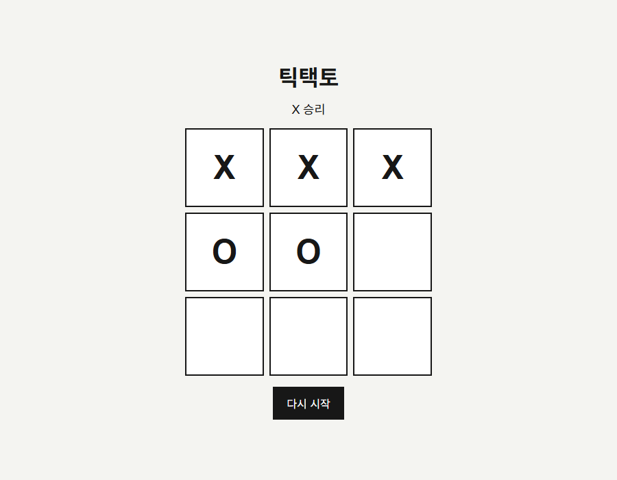
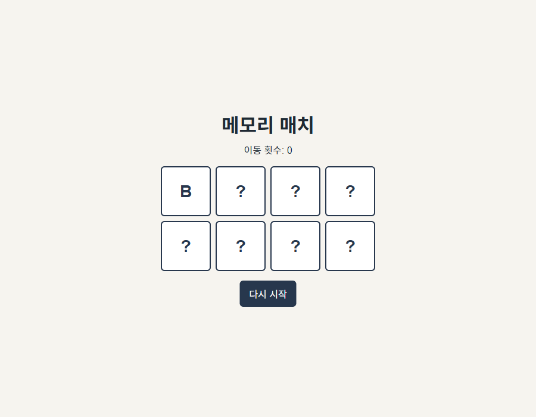
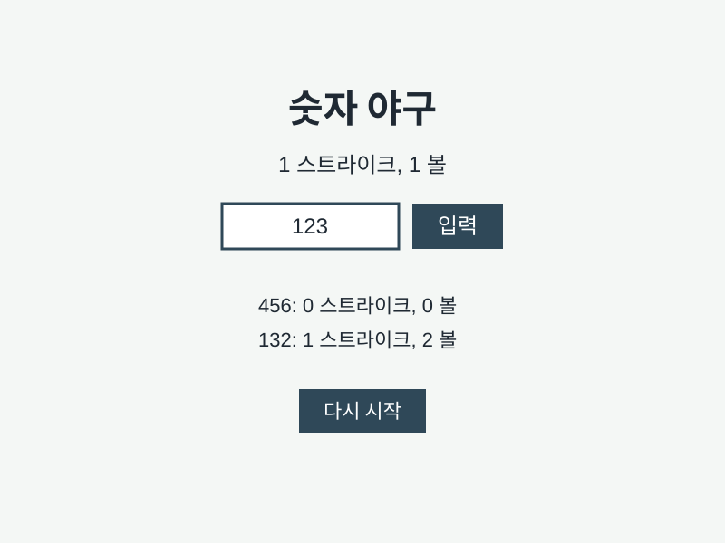
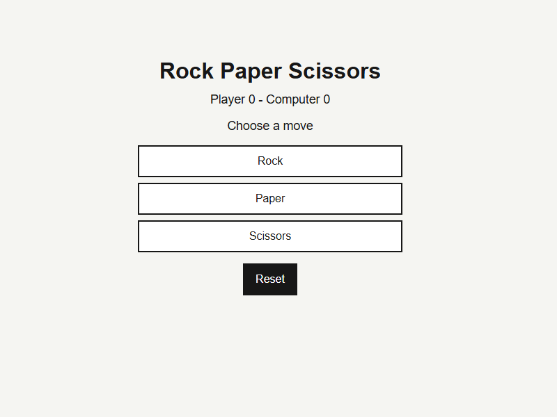
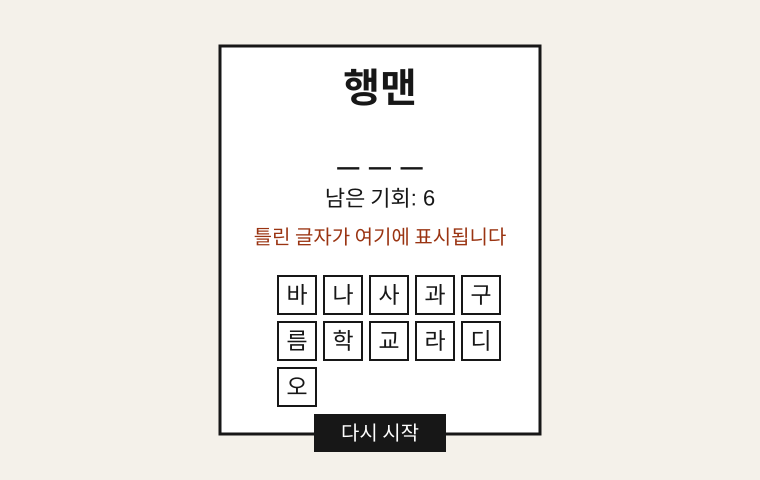
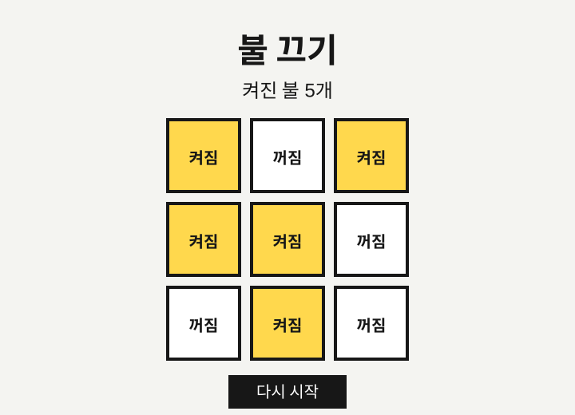
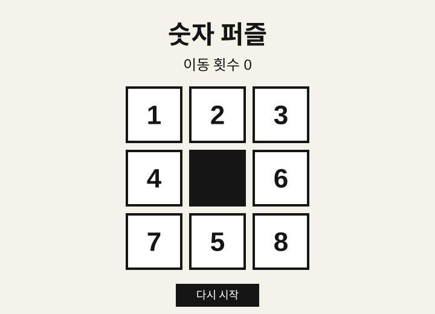
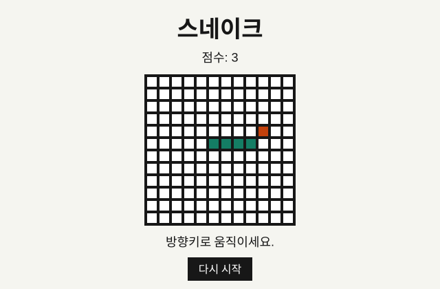
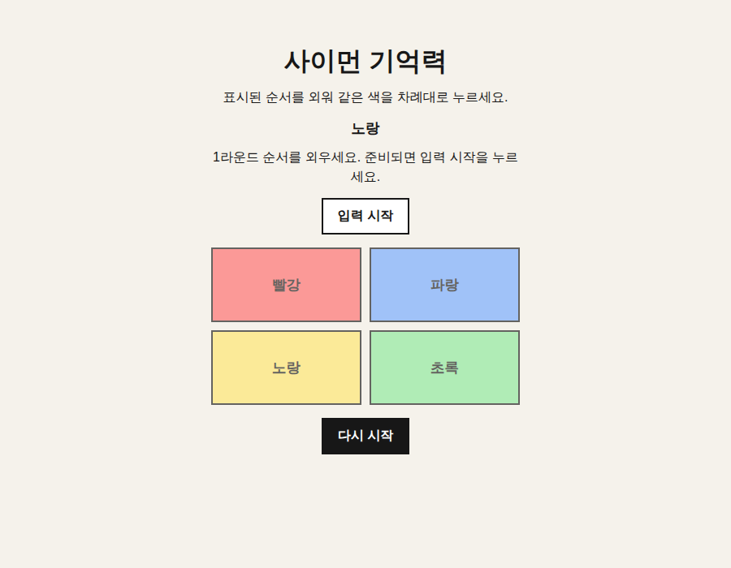

# 데일리 클래식 게임 아카이브

메인 README가 길어지지 않도록 이전 게임 설명과 화면을 보관합니다.

## 게임 목록

| 날짜 | 게임 | 설명 |
| --- | --- | --- |
| 2026-04-24 | 틱택토 | 두 플레이어가 번갈아 3x3 칸에 표시를 놓는 게임입니다. |
| 2026-04-27 | 메모리 매치 | 카드를 뒤집어 같은 짝을 모두 찾는 게임입니다. |
| 2026-04-27 | 숫자 야구 | 서로 다른 세 자리 숫자를 스트라이크와 볼 힌트로 맞히는 게임입니다. |
| 2026-04-27 | 가위바위보 | 하나를 골라 컴퓨터와 라운드 점수를 겨루는 게임입니다. |
| 2026-04-29 | 행맨 | 한글 글자를 골라 숨겨진 단어를 맞히는 게임입니다. |
| 2026-05-11 | 불 끄기 | 칸을 눌러 주변 불을 함께 바꾸고 모든 불을 끄는 퍼즐입니다. |
| 2026-05-15 | 숫자 퍼즐 | 빈 칸 옆 숫자를 밀어 1부터 8까지 순서대로 맞추는 퍼즐입니다. |
| 2026-05-15 | 스네이크 | 방향으로 뱀을 움직여 먹이를 먹고 점수를 올리는 게임입니다. |
| 2026-05-15 | 사이먼 기억력 | 표시된 한글 색 순서를 외워 같은 순서로 누르는 기억력 게임입니다. |

## 게임 화면

### 틱택토



### 메모리 매치



### 숫자 야구



### 가위바위보



### 행맨



### 불 끄기



### 숫자 퍼즐



### 스네이크



### 사이먼 기억력



## 테스트

```bash
node daily/2026-04-24-tic-tac-toe/game-logic.test.js
node daily/2026-04-27-memory-match/game-logic.test.js
node daily/2026-04-27-number-baseball/game-logic.test.js
node daily/2026-04-27-rock-paper-scissors/game-logic.test.js
node daily/2026-04-29-hangman/game-logic.test.js
node daily/2026-05-11-lights-out/game-logic.test.js
node daily/2026-05-15-number-puzzle/game-logic.test.js
node daily/2026-05-15-snake/game-logic.test.js
node daily/2026-05-15-simon-memory/game-logic.test.js
```
